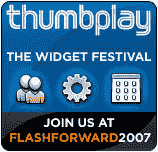

# 基于 Flash 的小部件构建者们请注意:赢取免费的 Flashforward2007 | TechCrunch 之旅

> 原文：<https://web.archive.org/web/http://techcrunch.com/2007/08/09/attention-flash-based-widget-builders-win-a-free-trip-to-flashforward2007/>

 [Thumbplay](https://web.archive.org/web/20140416101306/http://www.thumbplay.com/) ，优质移动娱乐下载(铃声、游戏、视频等)的供应商。等等。)希望从 Flash 开发者那里获得一些外部帮助。他们将于 2007 年 9 月 19-21 日在波斯顿举办一个与 [Flashforward2007](https://web.archive.org/web/20140416101306/http://www.flashforwardconference.com/) 同时举行的 Thumbplay Widget Festival，并且正在寻找一个人来创建最终的基于 Flash 的 Widget，以帮助推广他们的移动内容选择。

只要“梦想、构建并提交”你最好的小工具(完全不要把你的垃圾小工具发给他们)或者任何其他使用整个 Thumbplay 目录的工具。单独注册可以让你提前看到 Thumbplay 的开发者计划，并访问 Thumbplay 的整个内容库。

跳完之后简单总结一下比赛的来龙去脉。

–所有注册开发人员都将获得一个价值 100 美元的折扣代码，用于 2007 年波士顿 Flashforward2007 的 3 日通票
–Thumbplay 将在美国东部时间 2007 年 8 月 8 日至 8 月 31 日下午 5:00 接受提交内容(每个注册人最多可接受三份提交内容)
–一个评委小组将审核所有提交内容，并在 9 月 6 日(星期四)左右通知获奖者。 2007 年
–五(5)个“荣誉小部件”将在 9 月 19 日星期三的 2007 年 Flashforward 大会上获得命名和荣誉
–一(1)个“最佳小部件”将获得 2007 年 Flashforward 大会的免费旅行和住宿，并将在 9 月 19 日星期三的大会上获得荣誉

更多关于拇指游戏部件节的信息和完整的注册细节可以在[这里](https://web.archive.org/web/20140416101306/http://partners.thumbplay.com/page/widget_festival)找到。