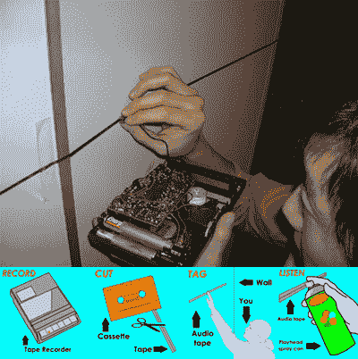

# 音频轰炸:基于磁带的涂鸦

> 原文：<https://web.archive.org/web/http://techcrunch.com/2007/05/07/audio-bombing-cassette-tape-based-graffiti/>

传统的涂鸦虽然难看，但意味着必须在建筑物的侧面喷涂标签，这是涂鸦艺术家的签名。音频轰炸是对使用盒式磁带作为媒介的实践的新尝试。你把你想说的话录在录音带上，然后把录音带从磁带上撕下来。然后你把这种胶带贴遍整个城镇——贴在建筑物的墙上、人行道上等等。使用特殊的磁头播放音频，然后完成标签。这实际上是我最近看到的比较有趣的东西之一，虽然我不知道这是否会改变我的想法，让我认为涂鸦是一种艺术，因为它不是。

这里面有一个古怪的视频。

 [https://web.archive.org/web/20150912100439if_/http://www.youtube.com/embed/qZI4X-75yc4?version=3&rel=1&fs=1&showsearch=0&showinfo=1&iv_load_policy=1&wmode=transparent](https://web.archive.org/web/20150912100439if_/http://www.youtube.com/embed/qZI4X-75yc4?version=3&rel=1&fs=1&showsearch=0&showinfo=1&iv_load_policy=1&wmode=transparent)

视频

音频炸弹是伊利诺伊大学香槟分校的几名学生创造的。我很喜欢。

[音频轰炸](https://web.archive.org/web/20150912100439/http://audiobombing.blogspot.com/) via [我们赚钱不是艺术](https://web.archive.org/web/20150912100439/http://www.we-make-money-not-art.com/archives/009513.php)