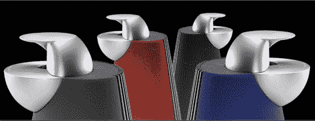

# Bang & Olufsen BeoLab9 扬声器:销售如此花哨，您几乎不知道它们是扬声器

> 原文：<https://web.archive.org/web/http://techcrunch.com:80/2007/04/25/bang-olufsen-beolab9-loudspeakers-marekted-so-fancily-youd-hardly-know-theyre-speakers/>

这些看起来很疯狂的东西是 Bang & Olufsen BeoLab9 扬声器。现在，当你去 B&F 的网站时，你会注意到这份拷贝读起来就像扬声器是某种联合国计划来拯救世界免于某种厄运。但事实并非如此。他们只是独特的扬声器。是的，他们有所有的好东西来确保他们听起来很棒，但真的没有理由宣布他们是第二次到来。

但是 BeoLab9 到底能提供什么呢？首先，它的形状可以最大限度地减少声音失真。它有一个 10 英寸的单元，由一个 400 瓦的放大器发出低音。它每双售价 9900 美元，所以如果你想创建一个完整的环绕声系统，请准备好贷款。我用[耳塞](https://web.archive.org/web/20140916163056/http://crunchgear.com/2007/04/20/history-changing-ultimate-ears-headphones-on-the-way/)就可以了，非常感谢。

[产品页面](https://web.archive.org/web/20140916163056/http://www.bang-olufsen.com/page.asp?id=292)【Bang&Olufsen via[Electronista](https://web.archive.org/web/20140916163056/http://www.electronista.com/articles/07/04/25/beolab9.loudspeaker.debuts/)】