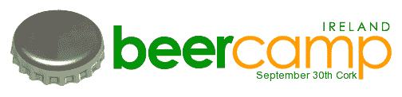

# BarCamp Ireland 成功了| TechCrunch

> 原文：<https://web.archive.org/web/http://techcrunch.com/2006/10/01/barcamp-ireland-is-a-success/>

这个周末是爱尔兰在科克的第一个 BarCamp，有 100 多人参加。你可以从日程表的这张[图](https://web.archive.org/web/20140903143259/http://www.flickr.com/photos/traftery/257148207/)中了解一下会谈的情况。

涵盖的主要话题包括微格式、OPML、融资、初创公司、第二人生和[汤姆·拉夫特里](https://web.archive.org/web/20140903143259/http://www.tomrafteryit.net/)就今年早些时候在科克建造的新数据中心和 Web 2.0 争议发表了演讲。

网上有一些图片[这里](https://web.archive.org/web/20140903143259/http://flickr.com/search/?w=all&q=barcampireland&m=text)和[这里](https://web.archive.org/web/20140903143259/http://flickr.com/search/?w=all&q=barcampireland&m=text)当然，如果事后没有一个快速啤酒杯就不会是爱尔兰；-)

