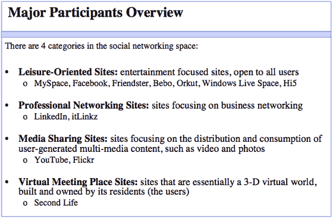
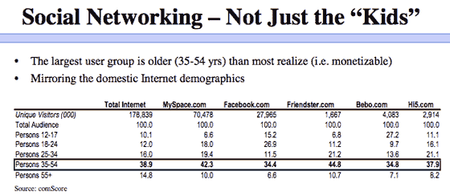
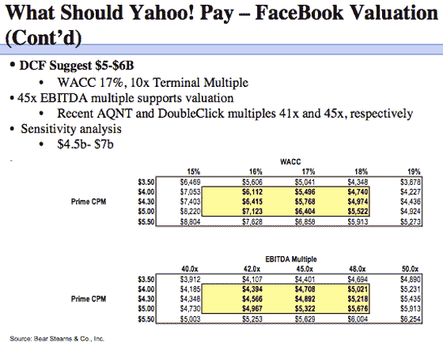

# 贝尔斯登:雅虎必须形成社交网络战略

> 原文：<https://web.archive.org/web/http://www.techcrunch.com:80/2007/08/03/bear-stearns-yahoo-must-form-a-social-networking-strategy/>

# 贝尔斯登:雅虎必须形成社交网络战略

贝尔斯登互联网分析师罗伯特·佩克几天前做了一个报告，引起了一些关于 T2 的议论。它建议雅虎在社交网络领域采取广泛的策略，并建议在短期内收购一家大型企业。

我在下面嵌入了完整的演示文稿。这是对社交网络的总体概述，佩克将其分为四种不同的类型:

佩克还指出，社交网络用户并不都是青少年——最大的用户群是 35-54 岁的人:

佩克还指出，社交网络拥有令人难以置信的影响力、页面浏览量增长和极高的参与度(在网站上花费大量时间)。他估计，到 2011 年，社交网络将控制 12%的在线广告。

然后，他继续提出一个论点，即雅虎应该收购脸书，这是他们去年尝试过但没有成功的事情。将他下面的估值模型(45-70 亿美元)与雅虎去年建立的[模型(16 亿美元)进行比较:](https://web.archive.org/web/20221115120209/http://www.beta.techcrunch.com/2006/12/12/yahoos-project-fraternity-docs-leaked/)

演示文稿中有很多信息需要消化。整件事见下文。此外，尽管告诉雅虎他们需要收购脸书很容易，但不清楚该公司是否会以任何价格出售。此时，公开市场对脸书的估值可能会超过 70 亿美元。未来某个时候，可能是脸书收购雅虎，而不是相反。

[http://static.scribd.com/FlashPaperS3.swf?guid = 2c 4p 55 cvw3d 6k&document _ id = 221717&page = 1](https://web.archive.org/web/20221115120209/http://static.scribd.com/FlashPaperS3.swf?guid=2c4p55cvw3d6k&document_id=221717&page=1)