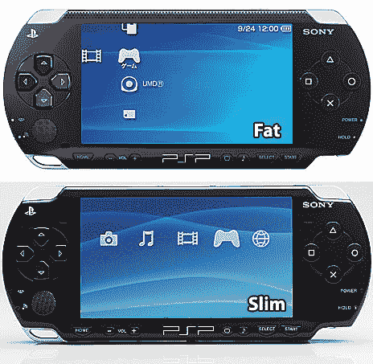
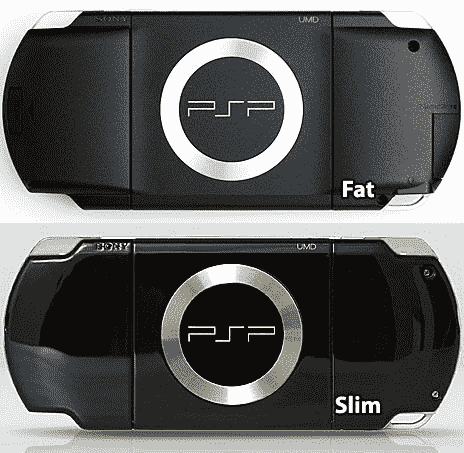
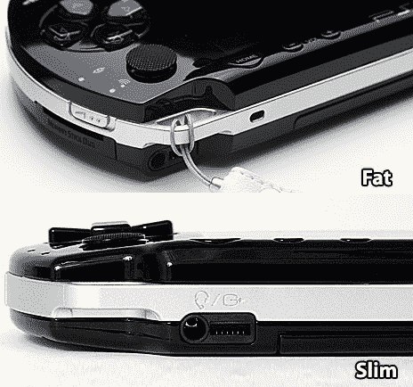

# 前后，PSP 版:Slim vs. Fatso 

> 原文：<https://web.archive.org/web/http://techcrunch.com:80/2007/07/17/before-and-after-psp-edition-slim-vs-fatso/>

# 前后，PSP 版:Slim vs. Fatso

你能处理更多新的和改进的索尼 PSP 的图片吗？你能处理 PSP 胖和 PSP 瘦的对比照片吗？实际上，我刚刚检查这两个系统的并排图片时心跳停止了。这两者看起来差不多，但是苗条的人比胖的人更有光泽，正如 GamePro 所说的那样“更圆”。就像[希基指出的](https://web.archive.org/web/20130628164954/http://crunchgear.com/2007/07/11/psp-2-first-images-emerge/)，它基本上是目前我们都知道的 PSP，嗯，不是爱，而是我们都用来玩 PS1 游戏的 PSP。(我目前正在完成我的 PSP 上的*恶魔城:夜之交响曲*。谢谢，开放固件！)

据说 Slim 比它的前身 Fatso 更“省油”。只要它持续超过 40 分钟，那么是的，是的，它会更“省油”

所以，是的，没有从任天堂 DS 到 DS Lite 的跳跃那么令人印象深刻。

[图片:PSP 胖 vs. PSP 瘦](https://web.archive.org/web/20130628164954/http://www.gamepro.com/news.cfm?article_id=122128) [GamePro]