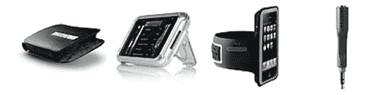

# Belkin iPhone 配件现已上市

> 原文：<https://web.archive.org/web/http://techcrunch.com/2007/07/02/belkin-iphone-accessories-now-available/>

Belkin 刚刚推出了他们的第一批 iPhone 配件，包括超薄外壳、丙烯酸外壳、臂带和耳机适配器。

这款修身款采用黑色皮革制成，配有一个皮带夹。它非常适合那些酷到拥有一部 iPhone，但又不想看起来很酷的人。我给你 29.99 美元。

丙烯酸外壳提供了更少的保护/更多的风格，可以完全接触到 iPhone 端口、按钮和屏幕。腰带夹兼作“视频观看支架”也是 29.99 美元。

运动臂章可以让慢跑者快速接触到他们想要在闪亮的新 iPhone 上擦拭他们肥胖、出汗的手指。向健身房里的每个人展示你是认真的(如果你的生意是骗人的)。你猜对了，29.99 美元。

耳机适配器售价 10.95 美元，是手机行业最大的骗局之一。如果你还没有的话，不妨弯腰去买一个。显然，99%的手机和 PDA 都不可能安装标准尺寸的耳机插孔。

[贝尔金 iPhone 配件【Belkin.com ](https://web.archive.org/web/20150911001253/http://www.belkin.com/ipod/iphone/)