# Belkin Network USB Hub 评论

> 原文：<https://web.archive.org/web/http://techcrunch.com:80/2007/06/29/belkin-network-usb-hub-review/>

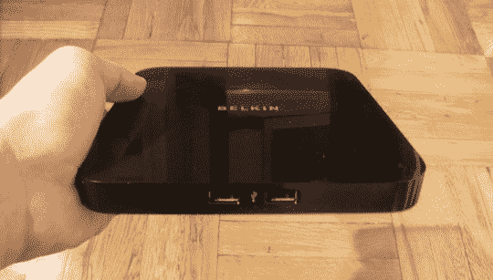

今天我们来看看 Belkin 的新网络 USB 集线器，它号称是市场上最容易配置的无线 USB 集线器，你也可以说它是市场上唯一的无线 USB 集线器。

基本上，Belkin 的软件会欺骗你的电脑，让它认为自己直接连接到了打印机或外围设备，而实际上它们是连接到你的路由器上的。鬼鬼祟祟！

听起来很简单，对吗？我们来看看吧…

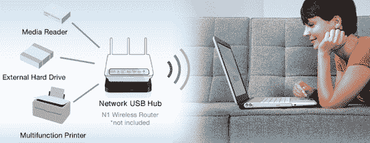
这位女士似乎很享受她的硬件

在前面，您会发现一个绿色的电源 LED 和两个 USB 端口，以便于访问。背面是另外三个 USB 端口(总共五个)、一个以太网插孔、电源输入和一个复位按钮。

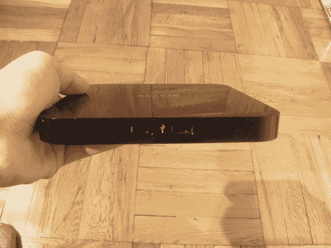
前面，还有我的脚趾

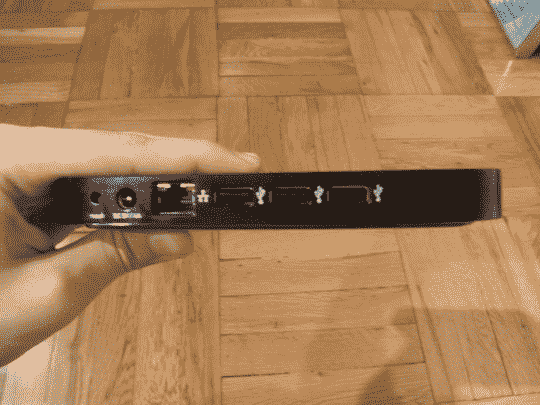
回

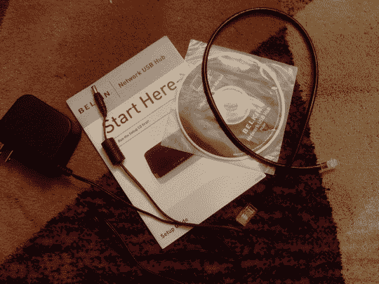
包含哪些内容

物理设置设备很简单:插上电源，然后将随附的以太网电缆连接到路由器，一切就绪。

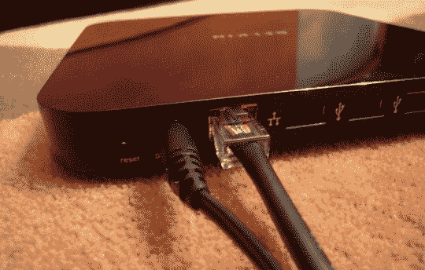
你需要连接什么

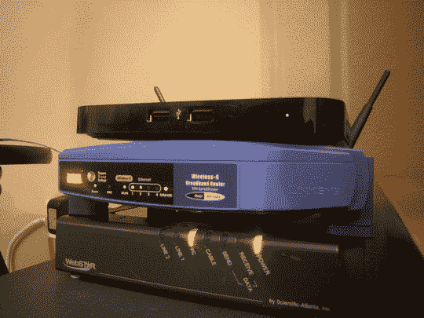
全部设置

如你所见，这款设备非常小巧，而且不显眼。简约 FTW。

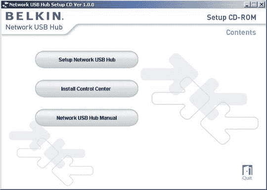
安装光盘

安装光盘非常简单，一开始就给你三个选项。“网络 USB 集线器手册”只需打开包装盒中手册的. pdf 文件。而第二个选项“安装控制中心”确实如它所说的那样，它安装一个控制面板。稍后会详细介绍。

现在，我们将单击“设置网络 USB 集线器”…

设置这个花费了大约 30 秒。我们所要做的就是输入“以太网代码”并点击几次“下一步”。一切都是自动完成的。完成后，它给了我们安装控制应用程序的选项。不需要做任何改变，安装几乎立刻就完成了。

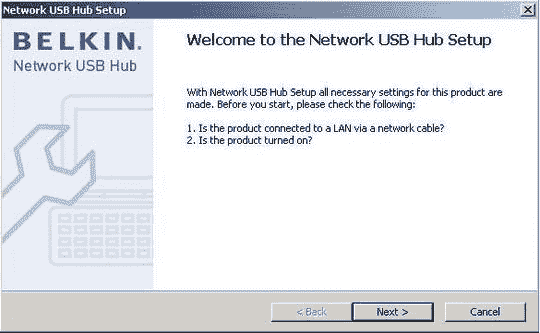

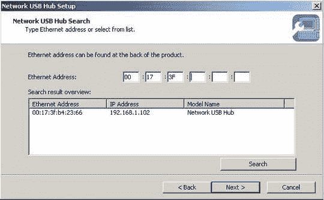

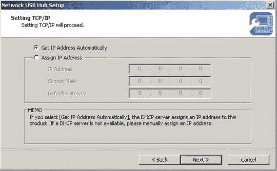

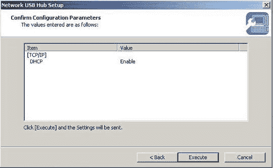

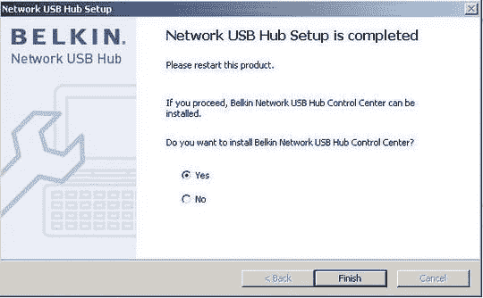

如果您选择“是”，在您单击“完成”后，控制面板将自动安装。

控制中心非常有用，同时也很简单。它提供了更新等选项，并允许您控制多个网络 USB 集线器。设备可以一次连接到一台计算机，如果设备连接到其他人的机器，有一个按钮可以请求使用设备。我们还没有测试过这个功能，但是很可能会弹出一个对话框，告诉我们哪台计算机需要这个设备。

令人惊讶的是，当我们将 USB 驱动器插入集线器时，所有常见的“发现新硬件”气泡都会弹出，我们可以立即通过文件管理器访问该驱动器。插入集线器的外围设备可以设置为在启动控制面板时自动连接到您的计算机。不幸的是，设备一次只能被一个人使用，所以如果有人正在使用外围设备，你就必须等待轮到你。

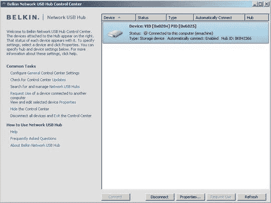
存在一个断开按钮，以使设备对网络上的其他人可用

当连接时，控制面板应用程序只是在系统托盘中空闲，而您可以使用连接到集线器的打印机、硬盘和其他外围设备，就像它们直接插入您的计算机一样。使用打印机也一样简单。通过在计算机上安装适当的驱动程序，打印机也可以像直接连接一样工作。

网络 USB 集线器是一种共享和分散外设的聪明方法。因为它位于专用打印/存储服务器和普通老式 USB 集线器之间，所以很难准确地对这种设备进行分类。然而，贝尔金创造了一些独特的和非常有用的东西，所以他们是值得称赞的。

*Mac 驱动程序将于 9 月上市*

[新闻稿](https://web.archive.org/web/20170708015730/http://www.belkin.com/pressroom/releases/uploads/05_15_07NetworkUSBHub.html)

[产品页面](https://web.archive.org/web/20170708015730/http://www.belkin.com/networkusbhub/)