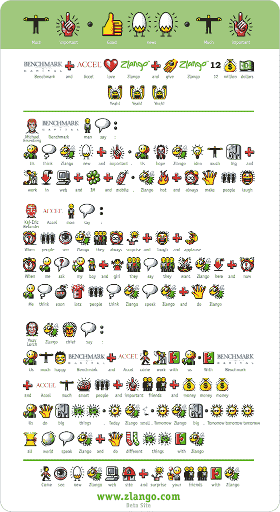

# Benchmark 和 Accel 投资 1200 万美元支持 Zlango

> 原文：<https://web.archive.org/web/http://techcrunch.com/2007/02/11/benchmark-and-accel-put-12m-behind-zlango/>

# Benchmark 和 Accel 投资 1200 万美元支持 Zlango

 Benchmark Capital 和 Accel 向以色列移动初创公司 [Zlango](https://web.archive.org/web/20201205144943/http://mobilecrunch.com/2006/06/28/is-zlango-the-universal-translator/) 投资了 1200 万美元。Zlango 是一个基于图标的移动信息服务。用户发送用代表性图像输入的短文本，而不是打出消息(见下文)。这就像是现代的象形文字。用户还可以在语言的基本图标上添加图像，正如 Zlango 在他们的新闻稿中所做的那样。

Zlango 是一个基于手机的应用程序，通过与运营商的密切关系而发展，运营商将 Zlango 视为提高短信使用率或固定费用的一种方式。Zlango 目前与以色列的 Pelephone、ESC 的 Orange & Cellcom、波兰的 P4 和加勒比海的 bMobile 合作。

这笔资金接近 Accel 最近从早期移动浏览器公司 OpenWave 聘请的移动专家 Richard Wong。自从去年四月 Accel 失去合伙人彼得·芬顿成为基准资本以来，两家公司的关系似乎已经恢复。

[TechCrunch](https://web.archive.org/web/20201205144943/https://crunchbase.com/organization/techcrunch) 也有[覆盖](https://web.archive.org/web/20201205144943/http://www.beta.techcrunch.com/2007/02/11/zlango-update-benchmark-and-accel-invest-12-million/)。

