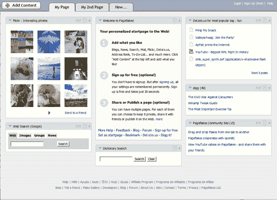

# Benchmark 投资 Pageflakes: Ajax 桌面大战升温

> 原文：<https://web.archive.org/web/http://www.techcrunch.com:80/2006/05/30/benchmark-invests-in-pageflakes-ajax-desktop-war-heats-up/>

# Benchmark 投资 Pageflakes: Ajax 桌面大战升温

  德国初创公司 [Pageflakes](https://web.archive.org/web/20220117012209/http://www.pageflakes.com/) ，一家富含 Ajax 的个性化主页(早期简介[在此](https://web.archive.org/web/20220117012209/http://www.beta.techcrunch.com/2005/12/18/yep-one-more-ajax-desktop-pageflakes/))将于周三宣布由 Benchmark Capital 领投的 A 轮融资。这一轮的规模将不会被披露，这表明它是在低水平。

三月下旬，总部位于巴黎的竞争对手 [Netvibes](https://web.archive.org/web/20220117012209/http://www.netvibes.com/) 宣布了一轮[100 万美元](https://web.archive.org/web/20220117012209/http://www.beta.techcrunch.com/2006/03/22/netvibes-to-announce-seed-financing-today/)的种子融资。Netvibes 和 Pageflakes 都与微软的 Live.com 和其他个性化起始页竞争。虽然它们的交通远不及 Live.com，但用户经常评论说，相比之下，他们喜欢 Pageflakes 和 Netvibes 网站的速度。

Benchmark 积极投资总部位于欧洲或专注于新的消费者网络创业公司。他们最近在 Bebo 领投了 1500 万美元的一轮融资，Bebo 以前的总部在英国(现在在旧金山)。

