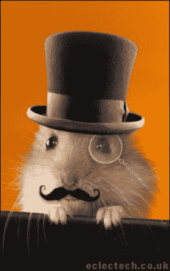

# 百思买科技告诉所有

> 原文：<https://web.archive.org/web/http://techcrunch.com/2007/07/10/best-buy-tech-tells-all/>

每个首席执行官都讨厌的网站 Consumerist 刚刚对百思买的一名前员工进行了一次大规模采访，他基本上说 Geek Squad 的技术人员盗版 MP3，向业余色情网站出售业余色情内容，并且通常来自昂贵而危险的 IT 管理员学校 Devry。

> 那么偷色情是一种不服从和表演的形式吗？
> hashand:嗯，更多的是一种“我想要我想要的，没有理由不拥有它”的感觉，即 mp3 共享。实际上，我们的工资比好市多的一份工作还低，福利简直是个笑话。

显然，因此我需要把我的仓鼠对仓鼠色情作品卖给 hamsterfancyafterhours.com。

[为什么极客会从你的电脑里偷色情内容](https://web.archive.org/web/20141016165756/http://consumerist.com/consumer/interviews/why-computer-repair-techs-steal-porn-from-your-computer-276527.php)