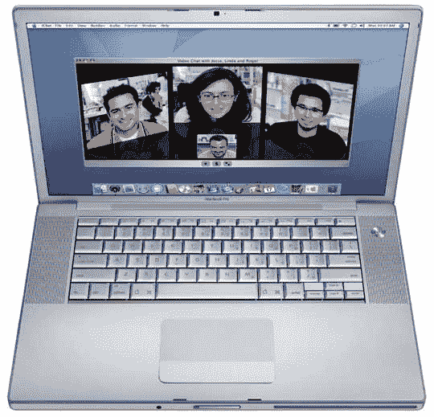
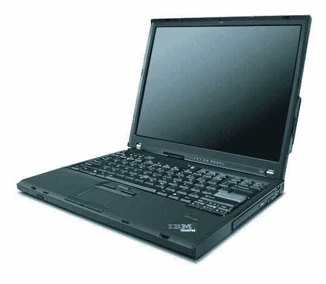
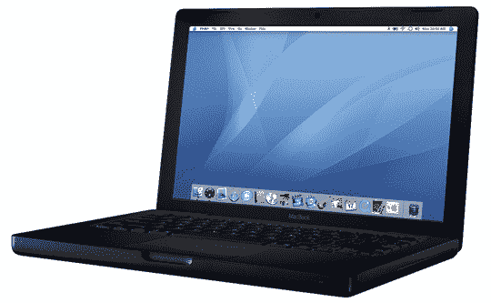
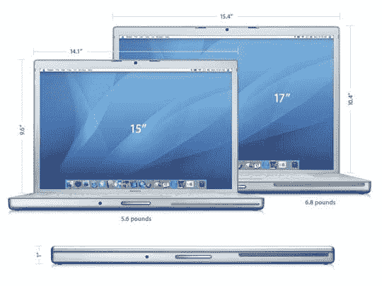

# 最佳旅行笔记本——TechCrunch

> 原文：<https://web.archive.org/web/http://techcrunch.com/2007/03/19/best-travel-notebooks/>

做一名极客公路战士，从来没有比现在更好的时机了。今天存在的技术在十年前似乎还是科幻小说里的东西。尤其是笔记本电脑，在体积缩小的同时，性能也得到了极大的提升。美好时光。

我最近发现自己处于这种情况，即使在我的位置上，这也是一个非常困难的情况。但是考虑到这个过程，我能够为所有类型的频繁出差族指出并演示几种可能性:

[ThinkPad T60 宽屏带 ABGN 无线](https://web.archive.org/web/20210301234552/https://beta.techcrunch.com/wp-content/uploads/2007/03/customize.gif)

如果这个系统在几个月前就可以使用，我可能会在我的 MacBook Pro 上得到它。正如标题所示，该系统包括一个集成的 a/b/g/n 天线，这将是非常有用的很快。在我对 Draft-N 的测试中，距离和速度都得到了很大的提高，这使得它成为了一个标准，一旦它实际上被标准化了，它就有了很大的潜力。

T60 也有大量的升级选项。屏幕有 15.4 英寸的 WSXGA TFT (1440×900)，但可以升级到 WSXGA+ (1680×1050)，价格仅为 75 美元。它还标配了 1.83GHz 的英特尔酷睿 2 双核处理器，但它可以通过 4MB 的高速缓存一直提升到 2.33GHz(只需 575 美元的升级*咳*)。该系统可以配备 ATI Mobility 镭龙 X1400，具有 128MB 的独立显卡专用内存(强烈建议升级)。

如果你愿意，它还可以内置 WWAN，价格大约是 50 美元。不过我不推荐在这里使用，因为唯一的选择是通过 Cingular 和威瑞森——Sprint 肯定是一条路要走。幸运的是，它有一个 ExpressCard 插槽，所以获得一张售后卡完全不是问题。

配备 ABGN Wireless 的 T60 宽屏电脑起价为 1073 美元，可以贵到你想要的价格。

 [MacBook 黑](https://web.archive.org/web/20210301234552/http://store.apple.com/1-800-MY-APPLE/WebObjects/AppleStore.woa/6694001/wo/oe3duy7sWX3v3TVwmHb1Elelt2v/2.?p=0)

这似乎是最受欢迎的旅行系统。通过我的旅行，我看到使用 MacBook Black 的人比任何其他系统都多。我没有销售数字或任何东西，但从我目睹的情况来看，我认为该系统的销量肯定超过了所有笔记本电脑。

该系统小巧且功能多样，包括一个 2.0GHz 英特尔酷睿 2 双核处理器。通过大约 300 美元的升级，它可以变得更好。将内存翻倍至 2GB，将硬盘提升至 160GB 是绝对必要的。

我对这个系统的主要问题是它缺少一个 ExpressCard 插槽。这将阻止您使用 ExpressCard WWAN。你可以使用 USB 加密狗，但我出于某种原因拒绝使用。如果未来的版本将继续没有扩展槽，我建议苹果直接将 WWAN 内置到系统中。这一增加将使它成为迄今为止最好的旅行系统。

MacBook Black 现已上市，现货价格为 1499 美元，指定价格为 1774 美元。

[MacBook Pro 15 寸](https://web.archive.org/web/20210301234552/http://store.apple.com/1-800-MY-APPLE/WebObjects/AppleStore.woa/wa/RSLID?ncto=MacBookPro&aa=69EF97D7&mco=69EF97D7)

经过深思熟虑，我最终选定了 15 英寸的 MacBook Pro，我很高兴地说，我对这个系统非常满意。它仍然困扰着我，系统只能配备 5400rpm 的硬盘，但我被告知这是因为热量问题。17 英寸的型号可以选择 100GB 7200rpm，所以如果你不介意那种巨大的东西，它可能适合你。

否则，MacBook Pro 会提供我推荐的所有东西。其诱人的尺寸加上快速的 2.33GHz 英特尔酷睿 2 双核处理器和带 256MB SDRAM 的 ATI Mobility 镭龙 X1600 使其从大多数竞争对手中脱颖而出。

我刚刚带着我的车进行了第一次大型越野探险，它表现得像冠军一样。能够使用 WWAN 完全改变了我的旅行，我不得不想知道没有它我们是如何度过的。

不过 MacBook Pro 并不便宜。2.33GHz 型号的价格为 2499 美元，税后价格将超过 2700 美元。这样的表现值得吗？我犹豫着说。这绝对是我拥有过的最好的 Mac，但那台 ThinkPad 的价格绝对更有吸引力。

[Alienware Area-51 m5790 特别版](https://web.archive.org/web/20210301234552/http://alienware.com/product_detail_pages/Area-51_m5790/area-51m_overview.aspx?SysCode=PC-LT-AREA51M5790&SubCode=SKU-DEFAULT#pdp-nav)

这是我见过的最糟糕的笔记本电脑。也是最大的。事实上，如此之大，以至于“笔记本电脑”这个名字可能有点不合适。也许“笔记本”更好，但似乎仍然关闭。我认为我们需要为这样的系统取一个新名字。

无论如何，如果您在旅途中需要台式机般的性能，那么这是您的最佳选择。它可以配备几乎一切。需要蓝光吗？没问题。超快的 ATI 移动镭龙 X1900 怎么样？是的，你也能得到。它甚至可以与超频到 2.66GHz 的英特尔酷睿 2 双核处理器一起使用，这使它成为目前最快的笔记本电脑。

现在，我不指望人们会带着这个系统到处跑，但它对旅行者来说是一个非常重要的地方。它完美地实现了从一个包中获得类似桌面的性能。它本质上是一个移动工作站。

17 英寸显示屏的库存为 WXGA+，但可以升级到 WUXGA+ (1920 x 1200)。这是一个值得拥有的景象。它还包括一个带数字键盘的全键盘。

它的速度和表演一直让我惊叹。实际上比我现在的桌面还快，这让我感到有点不安全。我可以把这样的东西作为我的下一个系统，只需把显示器和外围设备插入其中。

m5790 特别版起价 1299 美元，但老实说，没有人会得到普通版——升级太好了。

*这篇文章是我们关于极客的[旅行系列的一部分。](https://web.archive.org/web/20210301234552/http://crunchgear.com/category/travel-for-geeks/)*