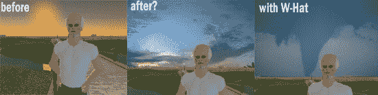

# 更好的云，第二人生的风 

> 原文：<https://web.archive.org/web/http://www.techcrunch.com:80/2007/05/21/better-clouds-wind-coming-to-second-life/>

# 更好的云，风来到第二次生命

第二人生背后的公司  [林登实验室](https://web.archive.org/web/20230216130921/http://lindenlab.com/)宣布从[向风标记互动](https://web.archive.org/web/20230216130921/http://www.windwardmark.net/)收购图形技术。林登实验室将收购 [WindLight](https://web.archive.org/web/20230216130921/http://www.windwardmark.net/products.php?page=windlight) ，一种先进的大气渲染技术； [Nimble](https://web.archive.org/web/20230216130921/http://www.windwardmark.net/products.php?page=nimble) ，逼真的 3D 云模拟器；以及相关的知识产权和利益。

一旦收购完成，林登实验室计划开源该技术，并将其集成到第二人生中，为第二人生元宇宙带来新的现实主义水平。

WindLight 使用的算法模拟了光线受现实世界大气因素(如灰尘和水分)影响的方式，从而能够实时准确地模拟阳光、云、水和天气的细微差别。Nimble 使用先进的物理模型来逼真地模拟云。

[Windward Mark Interactive 开发的网络游戏 Alliance](https://web.archive.org/web/20230216130921/http://www.alliancethegame.com/) 不构成收购的一部分。

*原图像信用[蒂姆·布雷](https://web.archive.org/web/20230216130921/http://www.tbray.org/ongoing/When/200x/2006/03/27/Full-of-Second-Life)*