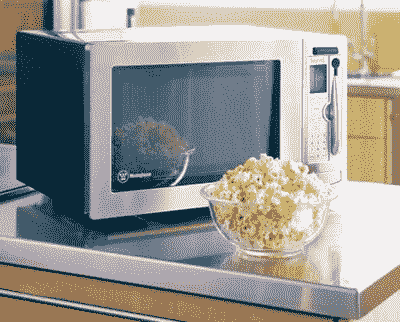

# 超越微波炉| TechCrunch

> 原文：<https://web.archive.org/web/http://techcrunch.com:80/2006/08/28/beyond-microwave-oven/>

我有几个朋友可以从智能家居的[超越微波炉](https://web.archive.org/web/20151220091852/http://www.smarthome.com/13041.html)中受益匪浅。使用条形码扫描仪，这种微型可以自动调整烹饪时间和温度。它具有 4000 个预编程的项目，并根据你扫描的内容，分析食物，并根据条形码提供的信息估计适当的设置。正如 Popgadget 指出的那样，这对于实验或剩菜来说毫无用处，但对于 150 美元来说，它的价格并不荒谬。更不用说它看起来又漂亮又时尚。

[超乎寻常的微波炉](https://web.archive.org/web/20151220091852/http://www.popgadget.net/2006/08/a_microwave_bey.php)【pop gadget】