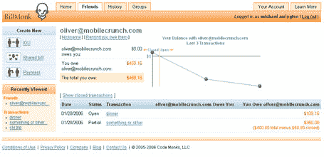

# BillMonk -社交资金 

> 原文：<https://web.archive.org/web/http://www.techcrunch.com:80/2006/01/20/billmonk-social-money/>

[【bill monk】](https://web.archive.org/web/20230213072532/https://www.billmonk.com/)是一项新服务，让人们可以轻松跟踪朋友之间的财务债务。这是一个简单的想法，他们执行得很好。

这个想法是，用户想要报告欠他或她的债务(如共享账单)，或给另一个人的欠条，只需在 BillMonk 上输入即可。这在 BillMonk 上很容易做到，即使是更复杂的交易，比如多人共享的账单。你只需输入账单金额和参与者的电子邮件地址。还有一个短信功能，允许用户在手机上发送账单。

我喜欢 BillMonk 跟踪用户与不同人的各种交易以及任何给定时间的当前欠款金额的方式。例如，如果我为我的朋友 Orli Yakuel 买晚餐，我们决定分摊 100 美元的账单，后来我欠她 8 美元的咖啡费，BillMonk 知道她总共只欠我 42 美元。当我告诉 BillMonk 她付给我 20 美元时，它会自动将欠我的金额降低到 22 美元。

当然，如果我发邮件的人还没有使用这项服务，他们可以注册。所以他们已经覆盖了病毒的角度。

它很有用，而且没有 FAQ 参考也很容易使用。还有一种方法是通过移动设备发送短信账单。然而，截至目前，他们还没有集成 paypal 或任何其他支付 API。

斯科特·洛夫特斯和约翰·库克最近也写了关于比尔蒙克的文章。该公司由 Gaurav Oberoi 和 Chuck Groom 创建，他们之前在亚马逊工作。