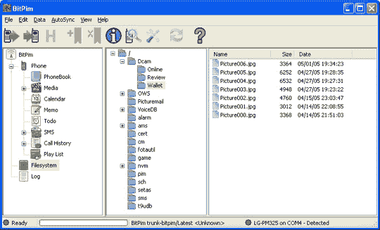

# BitPim 推出 1.0 版本:用它来添加古怪的铃声和修改其他手机数据

> 原文：<https://web.archive.org/web/http://techcrunch.com/2007/06/13/bitpim-hits-version-10-use-it-to-add-wacky-ring-tones-and-modify-other-cellphone-data/>

这是一个聪明的开源软件，可以让你的星期三开始。BitPim 用于修改 CDMA 手机数据——你知道，像铃声、壁纸、地址簿、提示音、视频等。它刚刚推出了 1.0 版本，我建议你去看看，尤其是如果你是像我一样的威瑞森无线用户。VZW 喜欢把手机弄得嘎吱嘎吱响，这让人们几乎无法做一些简单的事情，比如设置一个有趣的铃声(我在手机上使用了*Viva pia*主题！).

BitPim 并不适用于所有手机，但至少它兼容 USB 连接和蓝牙。

[BitPim](https://web.archive.org/web/20131111170703/http://www.bitpim.org/)