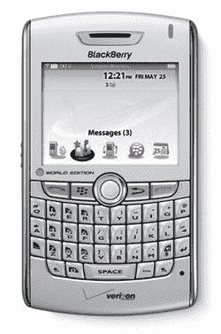

# 黑莓 8830 今天登陆威瑞森无线

> 原文：<https://web.archive.org/web/http://techcrunch.com/2007/05/28/blackberry-8830-lands-on-verizon-wireless-today/>

太神奇了。根据传言[和](https://web.archive.org/web/20150912181937/http://crunchgear.com/2007/05/24/verizon-customers-could-get-blackberry-8830-on-memorial-day/)的说法，可以在 CDMA 和 GSM 网络上工作的[黑莓 8830](https://web.archive.org/web/20150912181937/http://crunchgear.com/2007/04/05/verizon-gets-the-blackberry-8830-world-phone/) 现在可以在威瑞森无线网上买到。毕竟，这是一款黑莓手机，所以你可以期待将电子邮件和互联网接入(EVDO/GPRS 版)推向全世界。它确实是“环游世界”，因为 8830 在 160 多个不同的国家工作，包括也门和密克罗尼西亚*等国际热点地区。

黑莓 8830 将花费你 300 美元购买一份闪亮的两年期纯语音合约，或者 200 美元购买一份包含语音和数据的合约。数据套餐很贵:带语音套餐每月 65 美元，不带语音套餐每月 70 美元。或者，如果你愿意的话，你可以注册一个现收现付的计划，相当于每兆带宽 20 美元。也许在地球 2 上这是可以接受的，但在我的世界里不是。

*或者不是

[产品页面](https://web.archive.org/web/20150912181937/http://estore.vzwshop.com/blackberry/)【威瑞森无线】