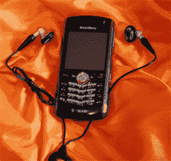

# 黑莓珍珠 8100 动手| TechCrunch

> 原文：<https://web.archive.org/web/http://techcrunch.com/2006/09/18/blackberry-pearl-8100-hands-on-2/>

黑莓珍珠是为女士打造的。它苗条、性感、酷。这并不是说男孩可能会喜欢它，但珍珠和 Sidekick 3 一样，旨在打破障碍，将那些可能认为自己不需要智能手机的人纳入 CrackBerry 的行列。像 SK3 一样，它是一款功能齐全的智能手机，伪装成一个又酷又时尚的玩具。

由于缺乏更好的术语，你可以把珍珠归类为网关手机。它没有 QWERTY 键盘，RIM 操作系统的企业功能隐藏得很好，确保普通用户可以打开盒子立即开始发送电子邮件。轨迹球绝对是一个额外的奖励，它允许一些非常聪明的菜单和图标导航。它也非常轻，大约 3 盎司，有一个美丽的明亮的屏幕和 130 万像素的摄像头。

我们喜欢珍珠有一个标准的 USB 充电器和连接端口。这使您可以将媒体拖放到设备中，并通过标准端口对其充电。它还支持音乐播放和黑莓地图。当与蓝牙 GPS 设备配对时，它甚至可以获取您的当前坐标。

在默认模式下，界面非常流畅，大多数主要应用程序都出现在第一个屏幕上。添加铃声和背景就像从 MicroSD 卡中选择一样简单，而且像往常一样，个人和企业电子邮件连接是无缝的。

该设备配有充电器、连接线和两个耳机——一个带单耳机，一个用于立体声音频。

如果你过去用过黑莓，它的界面会像一条旧牛仔裤一样熟悉。学习预测打字需要大约五分钟——这实际上是一个信任问题，因为你必须说服自己，键入几个随机数字最终会给你找到你要找的单词——即使在我可怕的地下室，它也有很好的接收效果，因为干扰问题，Sidekick 和大多数诺基亚手机都变成了一个纸镇。

我把手机给了妻子，她带着手机去上班，那里所有人——包括男孩和女孩——都疯了。她的一位同事带着它参加了一个公路战士会议——这些人一年 360 天都在旅行——他们并没有真正完成多少工作。他们都在玩珍珠。

有几款标志性手机让我们大吃一惊:StarTAC、RAZR 和 Sidekicks，仅举几例。将 Pearl 添加到这个列表中，因为尽管它没有完整的键盘或看起来像蓝色的机器肝，但它为大众带来了移动电子邮件和即时消息。再加上满满一茶匙的时尚和 T-Mobile 自己的广告努力，我觉得你有一个赢家。

[产品页面](https://web.archive.org/web/20150801233347/http://www.blackberry.com/products/blackberry8100/blackberry8100.shtml#specs)【黑莓】