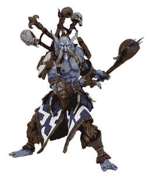

# 暴雪，DC 漫画联手制作魔兽世界动作人偶

> 原文：<https://web.archive.org/web/http://techcrunch.com/2007/02/08/blizzard-dc-comics-team-up-for-wow-action-figures/>

随着《魔兽世界》的用户数量飙升至 800 万，暴雪营销团队炮制出更多的动作玩偶只是时间问题。通过与 DC 无限公司(DC Comics)的合作，数字将在第三季度的某个时候推出，并在下周的纽约玩具展上首次亮相(CG 将在那里)。DC 说，首次亮相的雕像将在 5 至 8 英寸之间，由聚氯乙烯乙烯树脂制成。

四个初始数字将与两个字符的奖金集一起发布。你将能够获得一个血精灵盗贼、一把亡灵锁、一个兽人武士和一个矮人战士，以及一个豪华版德莱尼·帕利和炉石传说：伊利丹·怒风。

还没有价格方面的消息，但我猜你可以走进一个电子游戏，找到一些已经在出售的蹩脚的动作玩偶作为衡量标准。

[来自 DC](https://web.archive.org/web/20160407150607/http://kotaku.com/gaming/action-figures/wow-action-figures-coming-from-dc-234985.php)【Kotaku】的哇哦人偶