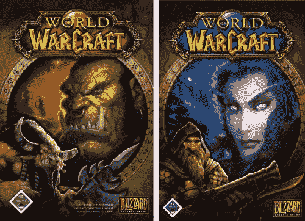

# 暴雪清空 WoW 玩家的银行

> 原文：<https://web.archive.org/web/http://techcrunch.com/2006/10/13/blizzard-empties-wow-players-banks/>

我不知道暴雪在做什么，但是如果他们不小心清空了人们的银行账户，他们有一些严重的问题需要解决。在*魔兽世界*中，你可以选择你想玩的特定服务器。服务器本质上就是你角色的世界。如果你想切换到和另一个服务器上的朋友一起玩，你必须支付一点费用，并让你的角色转移。Kotaku 的一个作家最近用他的信用卡转移了一个角色，并面临一些严重的问题。

首先，他被要求等 12 个小时才能转账。嗯，两天过去了，什么也没发生。这引起了 MMORPG 的恐慌，但事实证明他并不孤单——*魔兽世界*论坛充满了数百名面临同样问题的愤怒玩家。一个暴雪代表设法出现并复制粘贴了一个普通的错误信息。无论如何，玩家被要求再次登录他们的角色来完成转移，但这个过程仍然没有工作。玩家整天试图完成转会，但运气不佳。他们后来发现，暴雪每次都要收取他们 20 欧元的费用。

> 我又去了论坛，发现这种情况似乎不会发生在用信用卡转账的人身上，而只会发生在用借记卡转账的人身上。许多人抱怨说，他们的整个账户都被这个榨干了。他们完全破产了；他们的银行冻结了他们的账户。

这也不会有好结果。服务器传输已经 8 天没有工作了，暴雪也没有发布更多的信息。然而，暴雪今天设法拉下了转会页面，但是仍然没有任何官方声明。希望暴雪能尽快解决这个问题，在失败者从地下室出来给他们的妈妈打电话之前。开玩笑的。祝那些银行账户被掏空的人好运。