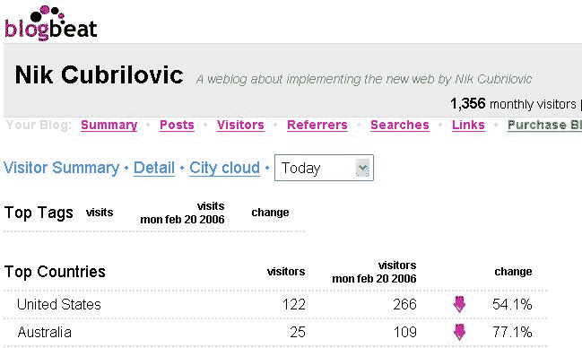

# 博客摇摆博客统计节拍！TechCrunch

> 原文：<https://web.archive.org/web/http://www.techcrunch.com:80/2006/02/21/blogbeat-rocking-the-blog-stat-beats/>

[谷歌](https://web.archive.org/web/20230217090009/http://www.google.com/)最近表示，他们收购了 [Measure Map](https://web.archive.org/web/20230217090009/http://www.measuremap.com/) ，非常认真地对待博客和博客统计数据。Measure Map 尚未进入大多数博客作者的手中，在被收购时还处于私人测试阶段。一个新的博客分析工具是 [BlogBeat](https://web.archive.org/web/20230217090009/http://www.blogbeat.net/) ，它在功能上类似于 Measure Map。BlogBeat 的不同之处在于，现在每个人都可以使用它。

几天前，我在我自己的博客上安装了 BlogBeat 安装过程包括将一段 HTML 复制到我的 [WordPress](https://web.archive.org/web/20230217090009/http://wordpress.org/) 安装的页脚模板中(它将与任何你可以编辑和访问模板的博客应用程序一起工作)。注册和安装的过程不超过一分钟，我能够立即看到谁在访问我的网站，以及该服务提供的所有其他统计数据。BlogBeat 将从您需要指定的 RSS 提要 URL 中读取关于您的博客的信息，并导出帖子统计数据。

BlogBeat 的首页向用户展示了他们的流量统计和 highlites 趋势的概述。您需要让代码运行几天才能从这个首页获得有意义的数据——例如，除非您已经运行该软件包一个月了，否则每月总结没有多大意义(也许在那之前应该隐藏一些东西)。BlogBeat 的界面非常简单干净，没有 MeasureMap 的界面吸引人，但同时也非常实用。

BlogBeat 是专门针对博客的，可以告诉你统计数据，比如哪些帖子最受欢迎，哪些类别最受欢迎，还可以跟踪评论，告诉你哪些帖子被评论最多，最近的评论是什么。通过帖子统计，它还显示趋势，尽管大多数统计包显示增长最快的帖子或页面是最近的(因为它们昨天不存在，所以“增长”总是 600%+)-如果目的是为了明确旧帖子可能出于任何原因再次变得流行，这是应该考虑的其他事情(这在我自己的博客上很常见)。

此外，还有一些区域描述了你的访问者来自哪里，他们是如何找到你的博客或某篇文章的，以及通过搜索引擎找到你的网站时使用了哪些关键词。最后一部分描述了哪些出站链接是最受欢迎的，以及用户从哪些点离开你的页面。BlogBeat 没有向我展示的一个简单特性是我的访问者在使用什么浏览器，尽管这不是最有用的统计数据，但知道这一点是有好处的。我相信我们很快就会看到这个特性。他们也在努力整合 FeedBurner(已经有了，看我在这篇文章末尾的更新)并且有一些很酷的功能，比如可以订阅你的数据(BlogBeat 也有一个 API)。

总的来说，我发现比起[谷歌分析](https://web.archive.org/web/20230217090009/http://google.com/analytics)(矫枉过正)，BlogBeat 是一种更好的跟踪我的网站访问者的方式(虽然我并不奇怪我是一个痴迷于数据的博客作者，我知道很多人都是)。我对跟踪统计数据的 javascript include 方法的担心是，首先，如果跟踪应用程序负载过重，它可能会减慢页面加载速度(这是 Measure Map 跟踪的博客访问者可能会经历的事情),其次，使用 javascript 可能不是所有访问者的真实表现，因为一些浏览器不会执行它，而其他浏览器可能无法执行它(开发人员仍然需要确保跟踪代码在所有浏览器上都能工作，如 Safari 等。) .另一种方法是使用可以直接访问服务器日志的统计包，但是这样会牺牲安装的方便性，并且不是所有的博客都可以访问他们的服务器。

BlogBeat 前 30 天免费，此后每月 6 美元(每月页面访问量限制在 500，000，如果超过不确定会发生什么)。他们目前有大约 400 名用户，性能很好，只有时间才能证明这一点。很高兴在这个领域看到更多的竞争和一些好的产品。我现在会坚持使用 BlogBeat，并在试用期结束前决定我是否能从它那里获得每月 6 美元的价值。

**更新**:BlogBeat 的 John 发邮件给我说他们有人口统计和浏览器统计(我只是没有看到，因为它在底部)，Feedburner 集成现在也在那里。这已经是一个很好的解决方案，还有更多的功能有待开发

