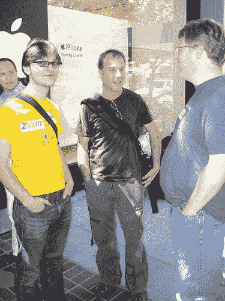
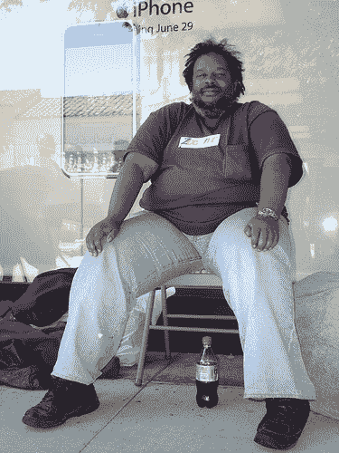
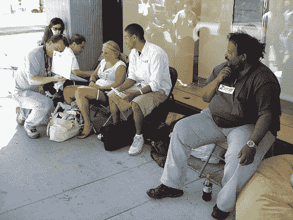

# 博客作者、首席执行官和其他所有为 iPhone TechCrunch 扎营的人

> 原文：<https://web.archive.org/web/http://www.techcrunch.com:80/2007/06/29/bloggers-ceos-and-everyone-else-camping-out-for-the-iphone/>

# 博客作者、首席执行官和其他所有为 iPhone 露营的人

随着对 iPhone 的期待达到白热化，我们不断收到人们排队购买自己的神奇手机的报道。到位于帕洛阿尔托的硅谷苹果商店快速走一趟，就能感受到席卷硅谷的热情。

仅次于他儿子的第二大热门博主罗伯特·斯考伯(Robert Scoble)打算用他价值 750 美元的 N95 3G 5MP 拍照手机换一部价值 600 美元的 200 万像素带 edge 摄像头的 iPhone。和他一起的还有 [Zoomr](https://web.archive.org/web/20221203093433/http://www.beta.techcrunch.com/2007/05/21/zooomr-mark-iii-new-features-better-look/) 的首席执行官托马斯·霍克和创始人克里斯托弗·泰特，他们通过分发编号标签来控制人群。他们后来加入了 Diggnation 的凯文·罗斯和亚历克斯·阿尔布雷特，他们也在报道受控混乱。

你可以在 [Ustream](https://web.archive.org/web/20221203093433/http://ustream.tv/channel/zooomr-tv) 和 [Justin.tv](https://web.archive.org/web/20221203093433/http://www.justin.tv/gizmodo) 上看到在线直播。他们都会排队等候，直到今天，6 月 29 日下午 6:00 iPhone 开始发售

这里有一些照片:

【T8

图片来源: [Techmeme](https://web.archive.org/web/20221203093433/http://techmeme.com/) 的 Gabe Rivera