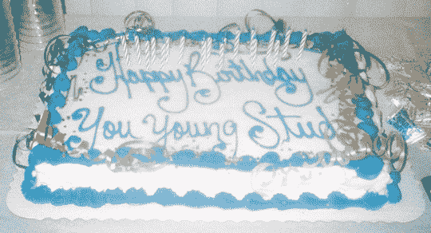

# 博客今年十岁了

> 原文：<https://web.archive.org/web/http://techcrunch.com/2007/07/15/blogging-turns-ten-this-year/>

祝你生日快乐，你从动物园逃出来了，你看起来像只猴子，闻起来也像只猴子——生日快乐，博客！

虽然很难确定博客大爆炸发生的准确时间，但人们普遍认为它发生在大约十年前，约恩·巴杰的机器人智慧网站。我不确定《华尔街日报》是如何计算出一个诞生于 1997 年 12 月 17 日的网站在 2007 年 7 月已经存在了十年，但是，嘿，这是一个非常大的新闻组织，你应该相信你读到的任何东西，不管它来自哪里，对吗？

实际上，我应该指出，华尔街日报说提供一个具体的日期太难了，我们应该承认 1997 年是博客开始的时间。所以你有它。

不管确切的日期是什么，花点时间回想一下 1997 年下半年你在做什么。我是一个来自中西部的天真、易受影响的无名小卒，正准备去普吉特湾大学，在那里我将度过开学的前三个月，喝着杰克·丹尼尔的酸醪威士忌和樱桃苦艾酒。

现在看着我！我是一个疲惫、固执的来自中西部的无名小卒，深陷于快节奏的博客世界，喝着酒精饮料，因为它应该是混合的——通常没有库尔-Aid。天啊，时代变了。

《华尔街日报》杂志的一篇文章介绍了一些博客名人，他们讨论了博客如何影响了他们的生活，以及它对整个社会的影响。博客如何影响了你的生活？

[快乐的献血者【【WSJ.com】](https://web.archive.org/web/20160206135048/http://online.wsj.com/article/SB118436667045766268.html)