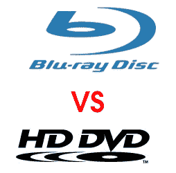

# 蓝光对 HD DVD:超时| TechCrunch

> 原文：<https://web.archive.org/web/http://techcrunch.com/2006/08/30/blu-ray-vs-hd-dvd-timeout/>

# 蓝光对 HD DVD:暂停

就在比赛即将结束，进入一场街头斗殴时，裁判叫了时间，并让参赛者回到各自的角落。违反了蓝色激光二极管的世界性短缺。拥有 80%蓝色激光二极管供应的 Nichia 公司报告说，其生产的收益率目前为 30%，但该产品仍然无法满足需求。

飞利浦、日立-LG、索尼、松下电器、Lite-On IT 和明基都有某种形式的驱动器生产，但目前只有 Pioneer 和 Plextor 能够保持定期出货量。据推测，东芝可能很快也能做到。

Lite-On 的 Michael Gong 认为，二极管供应的疲软将在明年初得到加强。希望他是对的。我一直在耐心地等待，以找出这些得到，我开始变得坐立不安。

由于激光二极管短缺，蓝光和 HD-DVD 的竞争冻结到 2007 年