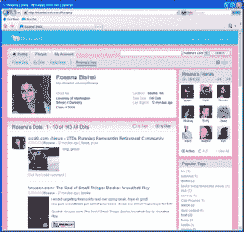

# 蓝点不仅仅是另一个社会化书签系统 

> 原文：<https://web.archive.org/web/http://www.techcrunch.com:80/2006/07/06/blue-dot-is-not-just-another-social-bookmarking-system/>

# 蓝点不仅仅是另一个社会化书签系统

总部位于西雅图的 T4 蓝点上周在 Gnomedex 推出了它的社交书签和网络服务。几个在线评论网站已经关注了社会化书签空间有多拥挤。我自己也在写一篇极其苛刻的帖子…直到我能打电话联系到公司。我错了。蓝点不仅仅是一个社会化书签网站。它有许多重要和不寻常的特点。

该公司由一个 10 人的扁平结构团队组成；没有人是其他人的老板，公司将这种结构的创新能力归功于它。一些团队成员来自微软和亚马逊。蓝点成立于 2004 年，有 5 名投资者，他们总共投入了 150 万美元的天使基金。这些投资者包括前星巴克高级副总裁唐·巴伦西亚和前微软高级副总裁理查德·法德尔。

该系统的基本前提是，用户可以将项目标记到他们的在线档案中，并与其他用户成为朋友，以共享对他们保存的部分或全部项目的访问。然而，真正的区别在于特性集。

其他社交书签服务可以让你将项目标记为公开或私有。蓝点允许您创建群组，并且只与这些群组的成员共享某些项目。群组成员可以在任何支持身份验证的提要阅读器中订阅这些提要。经过认证的 RSS 提要并不是一个广为宣传的特性，蓝点的第一个版本主要面向非技术用户，但它非常好。为不同的组设置不同的访问设置的能力比大多数面向消费者的在线社交书签服务要复杂得多。

**图像**您添加书签的页面中的图像会自动填充为蓝点。标记弹出框的一部分是一个字段，用于点击页面中的图像，直到您找到一个您想要选择包含在归档中的图像。我见过一些其他系统这样做，但不多。与大多数社会化书签服务的文本密集的外观相比，它是平滑的，并且有助于很好的用户体验。

 **评论**蓝点可以让朋友们对你收藏的物品发表评论。这并不完全是独一无二的，但这是一个很好的功能，还远没有普及。他们说，评论仅限于你的朋友这一事实将减少无用的反馈。我想，两种情况都有可能。

**Widget** 提供一个 Widget 来整合你最近的书签，这正成为社会化书签服务的最佳实践——但大多数都是 javascript 代码，而且很难看。蓝点有一个相对有吸引力的小工具，并提供了一个 Flash 版本。这意味着它可以在 MySpace 中使用。这是一件大事。该公司表示，他们将在短期内加大这方面的投入。

搜索社交书签+社交网络在搜索方面尤其有效。蓝点的搜索功能可以让你选择是否要搜索你的档案，你的朋友或所有用户。如果你在你朋友的档案中搜索，发现少于 10 个结果，那么系统将从所有用户中找出前十个结果。我一直很喜欢 LookSmart 的 Furl.net 在我的书签中搜索的功能，所有用户的书签和网络上的书签。蓝点把类似的概念带到了下一个层次。

我对蓝点还有一些问题。公司告诉我，将很快添加通过电子邮件或即时消息与蓝点的朋友直接沟通的功能。我希望如此，因为没有它，这个系统在社交上的使用是令人沮丧的。

蓝点表示，del.icio.us 进口商将很快推出。出口是他们正在考虑如何实施的事情。开放身份标准？无可奉告，到目前为止，这个话题只是公司里随意讨论的话题。

关于蓝点，另一件困扰我的事情是，他们给短语“社会发现”贴上了商标！该公司表示，他们这样做是因为他们不想被打上社交书签服务的烙印，他们希望成为这个新领域的先锋。我不买；我认为这是令人讨厌的，他们应该放弃。

尽管如此，我认为蓝点确实是一项开创性的服务。我很高兴我没有发表我最初写的讨厌的评论。