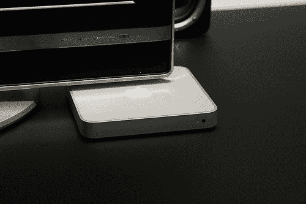

# Bob Iger 确认 iTV 硬盘

> 原文：<https://web.archive.org/web/http://techcrunch.com/2006/09/20/bob-iger-confirms-itv-hard-drive/>

# 鲍勃·伊格尔确认 iTV 硬盘

在昨天的一次会议上，迪士尼首席执行官鲍勃·伊戈尔透露了苹果即将推出的独立电视的一个关键细节:它有一个硬盘驱动器。虽然他没有说明硬盘有多大，但他解释说它可以直接在设备中存储媒体。伊格尔认为独立电视具有重大影响:

> 对我来说，它在很多方面都改变了游戏规则……顺便说一句，我喜欢它的地方是，它可能是一个为 TVR 体验向人们收费的机会。因为如果他们忘记设置他们的 TiVo 设备或 TVR，或者他们只是没有计划这样做，但他们想看他们错过的一集，他们可以去 iTunes，以 1.99 美元的价格购买，无线地[发送]到机顶盒源，并在电视上观看。

我不确定它是否会像他们想象的那样重要，但是我希望它是一个可靠的产品。我想我们明年春天会看到。

 [迪士尼的艾格:iTV 有个小硬盘](iTV%20Has%20a%20Small%20Hard%20Drive)【iPod 观察者】