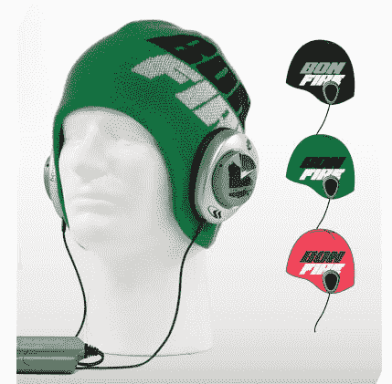

# 篝火头骨破碎机豆豆评论 TechCrunch

> 原文：<https://web.archive.org/web/http://techcrunch.com:80/2007/06/02/bonfire-skull-crusher-beanie-review/>

# 篝火头骨破碎机童帽评论

我意识到夏天就要来了，我正在复习一顶帽子。我坐在我的公寓里，汗流浃背，我一点也不喜欢这样，但在我的家乡俄勒冈州，我并不是每天都能看到一家公司的小玩意。

[篝火](https://web.archive.org/web/20200804061641/https://crunchbase.com/organization/bonfire) 碎骨者无檐帽是真正的兴奋剂，如果不是因为 2004 年圣诞节的一次不幸的滑雪板事故，我会带着它上山。头骨粉碎者 Beanie 内置了来自 [Skullcandy](https://web.archive.org/web/20200804061641/http://www.skullcandy.com/) 的耳机，如此简单的东西，它真的可以交付货物。除了我收到的评论单元的颜色“开花”之外，我唯一的投诉是后面连接两个耳机的单线。我只是很挑剔，像这样的小事会让我烦恼，但这不会影响产品本身。令人惊讶的是，这种帽子非常适合我的头部，而且我看起来不像是戴了避孕套的样子，而这正是我戴帽子时通常的样子。毛绒绒衬里感觉很好。

通过电话传来的声音足以让你下山继续跑步。这些 [Skullcandy](https://web.archive.org/web/20200804061641/https://crunchbase.com/organization/skullcandy) 耳机真正酷的是它的“重击”功能。描述这个的最简单的方法就是把它和你能在美国大兵那里买到的非常便宜的贫民窟火箭筒低音炮相比较。我猜你在东海岸没有特种部队…真遗憾。无论如何,“扑通”是一个低音增强类型的功能，但它同时振动。它实际上很酷，我真的很喜欢它。所以不要认为我的意思是说它像巴祖卡的低音喇叭一样是贫民窟。控制单元可以让你打开或关闭“重击”,调节你想要的大脑嘎嘎声，它有一个夹子，所以你可以把它放在你喜欢的任何地方。

总的来说，Bonfire 的骷髅头粉碎帽是一个惊喜，如果你正在寻找一个内置电话的高质量的帽子，那么你真的不能出错。但在这种情况下，我是偏心的，因为帽子实际上适合我的头，看起来很好。它们的零售价从 40 美元到 80 美元不等，现在就可以买到。是的，我知道现在是夏天，但是你仍然可以去商店买滑雪板装备。

[产品页面](https://web.archive.org/web/20200804061641/http://www.bonfiresnow.com/1-catalog/products_detail.aspx?id=1420)