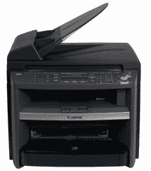

# 无聊版:佳能发布 imageCLASS MF4270 激光多功能打印机| TechCrunch

> 原文：<https://web.archive.org/web/http://techcrunch.com:80/2007/08/06/boring-edition-canon-announces-imageclass-mf4270-laser-multifunction-printer/>

为了满足小型企业和家庭办公室对经济实惠的网络工具的需求，佳能宣布推出 imageCLASS MF4270 激光多功能打印机。MF4270 速度极快，每分钟可打印 21 页。像哇哦！试着抑制你的兴奋，因为我正在努力抑制我的兴奋。它还可以直接从您的 PC 打印双面输出、接收传真和复印信纸大小的文档。MF4270 甚至可以以 9,600dpi 的速度进行 24 位彩色扫描！imageCLASS MF4270 MFP 在紧凑的桌面设计中提供了强大的传真解决方案，具有八个单触快速拨号号码、100 个编码快速拨号号码、256 页存储容量、PC 传真和双面双面输出。imageCLASS MF4270 使用 33.6 Kbps Super G3 传真进行快速传输。从下个月开始，只需 299 美元，所有这些都是你的了。