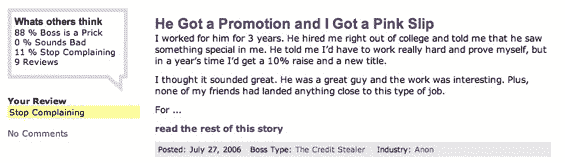

# 老板抱怨:谁是你最糟糕的老板？

> 原文：<https://web.archive.org/web/http://www.techcrunch.com:80/2006/08/08/bossbitching-whos-been-your-worst-boss/>

  这很有趣，就像是[一个古老的经典](https://web.archive.org/web/20150913145326/http://fuckedcompany.com/)但是是针对个别老板的。

BossBitching 是由一个自称是不知名的技术人员并声称住在纽约市的人发起的(这可能只是为了装样子)，它只是计划以 [UberBitching](https://web.archive.org/web/20150913145326/http://www.uberbitching.com./) 品牌推出的许多网站中的第一个。

BossBitching 让抱怨者根据原型对老板进行分类，读者可以在三个回答中选择一个来给出他们读到的故事，这比简单的竖起大拇指或向下好得多。

你知道他们说什么，找到一个基本的人类需求，给用户一个有吸引力的环境来满足他们的需求，你就拥有了一个高质量的网站！或者至少是一次战斗的机会。顺便说一句，你要知道，那个抱怨老板要求一整天不睡觉写博客的人不是我。