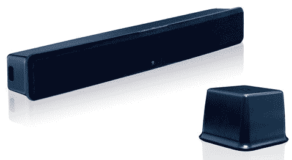
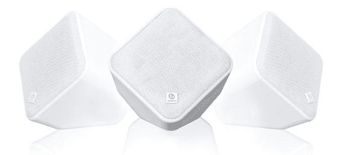
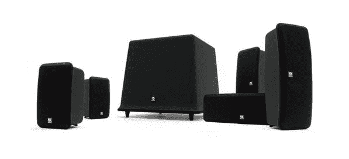

# 波士顿声学为富人，户外运动，沙发土豆

> 原文：<https://web.archive.org/web/http://techcrunch.com/2007/08/14/boston-acoustics-for-the-rich-outdoorsy-couch-potatoes/>

波士顿声学公司宣布推出三款扬声器系统，为您的电视观看、户外露天派对和势利需求增添趣味。TVee Model 是一个电视娱乐增强系统，由一个条形音箱组成，带有四个 2.5 英寸中低音驱动器和两个 0.5 英寸圆顶高音扬声器。TVee 条形音箱可以放在电视机的上方或下方，也可以安装在墙上。希望你的电视大于 13 英寸，因为那样会很傻很尴尬。超重低音扬声器配有一个 6 英寸的向下发射驱动器，并且是无线的，因此可以放在任何你想要的地方。整个系统输出 100W 有效值。

模型二似乎很容易使用和设置。“单线连接”连接到您的音频输出，就这样，您就完成了。你甚至不需要一个单独的遥控器。TVee 非常智能，它可以与您现有的遥控器同步，并知道何时静音和控制音量。TVee Model 预计将于 9 月上市，售价为 399.99 美元。

既然我们已经在室内做完了，就让我们到外面阳光明媚的地方去吧。由于有多种安装选择，双路 SoundWare 扬声器可以在室内或室外使用。这意味着你可以把它们放在任何你喜欢的地方。你甚至可以画出它们，让它们消失，融入到风景中。SoundWare 扬声器还提供黑色、白色、银色、“正红”、竹制、天然和浓咖啡。每个扬声器由一个 4.5 英寸的驱动器和 0.75 英寸的高音扬声器驱动。它们现在售价 99.99 美元。

排在最后的是巴的地平线系列扬声器系统。它们更加精致，更具美感。如果你这么说，巴。Horizon 系列包括十种不同尺寸和配置的扬声器。
该系列包括以下型号:HS 40 4.5″双向书架(SRP:99.99 美元)；HS 50 5.25″ 2 向书架(SRP:129.99 美元)；HS 60 6.5″ 2 向书架(SRP:149.99 美元)；HS 225 双 5.25”双向 LCR(SRP:249.99 美元)；HS 450 双 5.25 英寸双向落地支架(SRP $ 299.95)；HS 460 双 6.5 英寸双向落地式扬声器(SRP: $399.95)，8 英寸无线低音炮 HPS 8Wi (SRP: $399.95)，以及三款有源低音炮，10 英寸 HPS10 SE (SRP: $299.99)，HPS 10HO (SRP: $399.99)和 12 英寸 HPS 12HO (SRP: $499.99)，功率分别为 150，250 和 300 瓦

还有两个 5.1 声道的 SS 系统，不会让你倾家荡产，让你的系统走在最前沿。MCS 130 具有 3 个 LCR 扬声器，1 英寸高音和两个 3.5 英寸中低音驱动器，两个具有相同 LCR 统计的环绕扬声器以及一个 10 英寸向下发射的 200W 低音扬声器。100 包括四个带有 0.75 英寸高音的卫星扬声器、3 英寸驱动器、一个带有 0.75 英寸高音的中央声道、两个 3 英寸中低音驱动器和一个 8 英寸、100 瓦的 sub。它们都在 9 月上市，售价分别为 799.99 美元(130 英镑)和 499.99 美元(100 英镑)。

[波斯顿声学](https://web.archive.org/web/20160925022020/http://www.bostonacoustics.com/default.aspx)