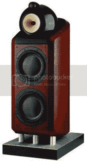

# 鲍尔和威尔金斯 800d 

> 原文：<https://web.archive.org/web/http://techcrunch.com/2006/08/22/bower-and-wilkins-800d/>

这款顶级 800D 的弧形机柜安装在一个沉重的铸铝底座上，底座上还安装了一个实质性的分频器。该音箱内置两个直径为 250 毫米的 Rohacell 锥形低音扬声器。低音输出通过向下发射的出气口得到加强，使 800D 能够在各种“真实世界”的房间和声学环境中最佳工作。800D 由凯夫拉尔锥和钻石高音扬声器制成，价格为 25，000 美元。

鲍尔和威尔金斯 800D