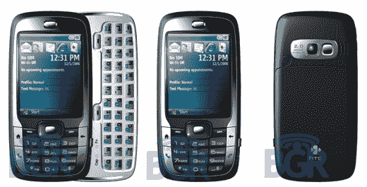

# 天才少年发布高质量 HTC Vox Pix——TechCrunch

> 原文：<https://web.archive.org/web/http://techcrunch.com/2007/01/24/boy-genius-unleashes-high-quality-htc-vox-pix/>

# 天才男孩释放高品质的 HTC Vox Pix

我们知道[之前的一组 HTC Vox 图片](https://web.archive.org/web/20210225230156/http://crunchgear.com/2007/01/17/htc-vox-spotted/)充其量模糊得要命。但是感谢 ~~3D 产品渲染~~摄影的力量，我们现在向你展示 HTC Vox 的所有荣耀。

如果你不了解最新情况，这可能是今年晚些时候在美国电话电报公司推出的热门 HTC 产品。它运行 Windows Mobile Crossbow，有一个 200 万像素的摄像头，一个滑出式 QWERTY 键盘和 WiFi。

[HTX Vox 新闻图片](https://web.archive.org/web/20210225230156/http://www.boygeniusreport.com/2007/01/23/htc-vox-press-photos/)【BGR】