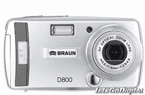

# 博朗 D800 剃须刀数码相机？！

> 原文：<https://web.archive.org/web/http://techcrunch.com/2006/10/06/braun-d800-shaver-digital-camera/>

不知道这到底是怎么回事。显然，布劳恩已经决定走出洗手间并开始拍照(或者可能正在洗手间拍照*)。*

美容专家将很快发布 D800 数码相机。它具有 620 万像素，插值至 800 万像素和 3 倍光学变焦。有 32MB 板载内存和 SD/MMC 扩展。它也有视频和音频功能，但不要指望那些太热门。

这绝对是一个入门级的相机，所以我怀疑任何人都会对此垂涎三尺。没有关于价格或可用性的消息。

[博朗 D800](https://web.archive.org/web/20151103012037/http://www.letsgodigital.org/en/10780/braun_d800/) 【让我们通过 [MobileWhack](https://web.archive.org/web/20151103012037/http://www.mobilewhack.com/reviews/braun_d800_digital_camera.html) 实现数字化】