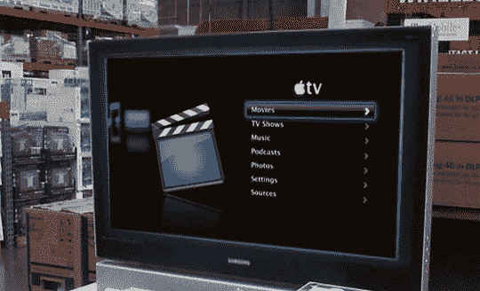

# 突发新闻，有点令人兴奋:苹果电视现在在好市多，已确认

> 原文：<https://web.archive.org/web/http://techcrunch.com:80/2007/05/01/breaking-mildly-exciting-apple-tv-now-at-costco-confirmed/>

今天，我们在互联网上看到各种传言，全国连锁折扣仓库[好市多](https://web.archive.org/web/20151201053819/http://crunchgear.com/?s=costco)可能会以低于苹果自己销售机顶盒的价格提供[苹果电视](https://web.archive.org/web/20151201053819/http://crunchgear.com/?s=apple+tv)。利用我们高超的新闻调查技巧(比如:一部电话)，CrunchGear 现在可以确认好市多正在以 289.99 美元的价格出售苹果电视。这比苹果或塔吉特公司出价低 10 美元。

目前，西雅图地区的三家好市多超市都有 20 种库存，全国其他地方也有。据我们当地分公司的 Sam 说，如果你附近的商店还没有，过几天再来看看就行了。我们还不确定好市多将如何展示苹果电视，但希望比苹果在自己的商店里做得更好，在那里标准清晰度的内容可以在高清电视上像素化播放。说真的。