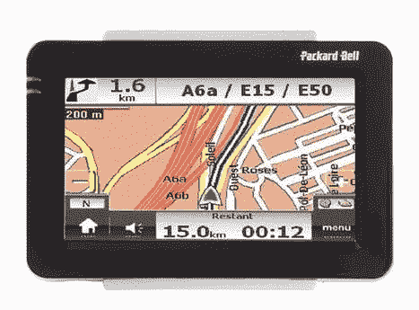

# 突发新闻:帕卡德·贝尔仍在经营，制造全球定位系统

> 原文：<https://web.archive.org/web/http://techcrunch.com/2007/05/04/breaking-packard-bell-still-in-business-making-gps-units/>

我应该写的是帕卡德·贝尔公司刚刚发布的这些漂亮的 GPS 装置，但是在研究我的故事时，我发现了更值得注意的事情:帕卡德·贝尔仍然是一家公司。

PB 于 20 世纪 20 年代中期在洛杉矶成立，在 20 世纪 80 年代末至 90 年代末成为世界上最糟糕的个人电脑制造商。事实上，帕卡德·贝尔开创了一种趋势，即电子机器后来开始使用非标准部件，但仍保持兼容性。这使得电脑往好了说是昂贵，往坏了说是不可能升级。你们中拥有公司电脑的人知道我的意思。[事实上，我有一台电脑，我很喜欢，所以就有了--JB]

不过，据说帕卡德·贝尔公司仍然在欧洲部分地区销售电脑，而且做得相当不错。这些盒子的质量没有被评论，所以我想看看我们的一些专家是否能给我们提供信息。

此外，PB 还为英国市场生产其他电子产品，如电视和这些看起来不错的 GPS 设备，在英国市场上它们被称为 Cpomasseo。两者都具有 4 英寸触摸屏，64MB 内置内存和 SD 卡支持。810 配有 1GB SD 卡上的地图，830 配有 2GB 卡，两者都包括实时交通信息服务，830 更详细。他们还播放电影，这正是你想在你的汽车仪表板上看到的，应该会在大约两个星期后在英国上架。

[Comasseo GPS 单元](https://web.archive.org/web/20131128035026/http://www.navigadget.com/index.php/2007/05/03/new-packard-bell-compasseo-gps-navigation-systems/)