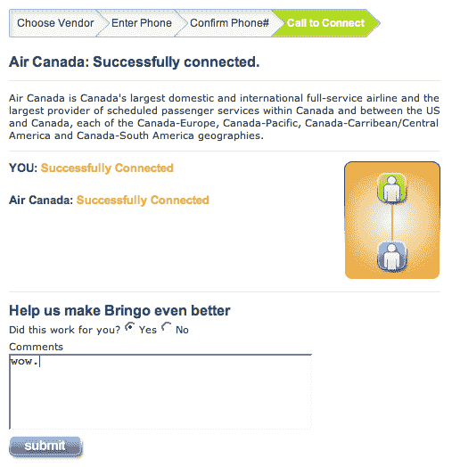

# 电话树黑仔。这是一项真正有用的服务——TechCrunch

> 原文：<https://web.archive.org/web/http://www.techcrunch.com:80/2007/05/15/bringo-phone-tree-killer-this-is-a-genuinely-useful-service/>

# 电话树黑仔。这是一项真正有用的服务

  [Bringo](https://web.archive.org/web/20220816074339/http://www.nophonetrees.com/) 解决了我们日常遇到的最令人沮丧的问题之一:电话树。打一个客户服务电话号码，然后在自动接线员的地狱里结束。

我已经记住了联合航空公司要尽快找到接线员必须按的键。对于其他公司，我只是一遍又一遍地按#键，同时不停地说“操作员”。有时候很管用。有了布林哥，这些都不重要了。你甚至不需要拨电话。只要在他们的电话号码簿中找到你想通话的公司，输入你的电话号码，几分钟后 Bringo 就会给你打电话，把你接到该公司的接线员那里。我在加拿大航空公司试过，效果非常好。

他们需要尽快创建一个精简的移动版本。

感谢提示[纳伦德拉](https://web.archive.org/web/20220816074339/http://www.30boxes.com/) ( [比兹·斯通](https://web.archive.org/web/20220816074339/http://bizstone.com/2007/05/skip-annoying-automated-phone-trees.html)最近也提到了他们)。

