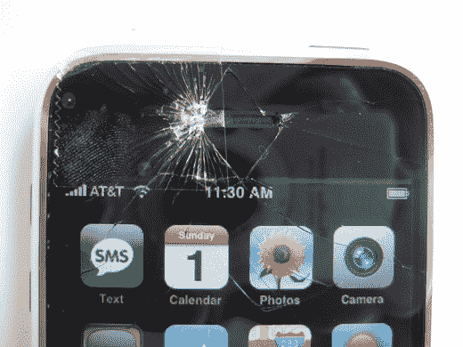

# Flickr  上出现坏掉的 iPhones

> 原文：<https://web.archive.org/web/http://techcrunch.com:80/2007/07/02/broken-iphones-appear-on-flickr/>

这是诗。照片出现在 Flickr 上，是被毁坏的、无法修复的 iPhones，我非常高兴。请注意，这不仅仅是幸灾乐祸。所有这些努力工作排队等候，与主流媒体交谈，好像没有更紧迫的问题需要讨论，所有这些只是为了发布一张显示屏幕破裂的照片。诗歌。

苹果免费更换了这款特别的 iPhone，这是我记忆中苹果的一贯做法。太糟糕了，要花[这么大的力气](https://web.archive.org/web/20150910151839/http://crunchgear.com/2007/06/30/iphone-gets-put-through-the-wringer/)才能打碎一部 iPhone。我期待着一个又一个的留言板帖子[抨击](https://web.archive.org/web/20150910151839/http://crunchgear.com/2007/07/01/bloops-first-anti-iphone-rants-rolling-in/)苹果粗制滥造的工艺。

[我坏掉的 iPhone(现已修复)](https://web.archive.org/web/20150910151839/http://www.flickr.com/photos/ficharker/sets/72157600594051928/detail/)【Flickr via[秋叶原新闻](https://web.archive.org/web/20150910151839/http://www.akihabaranews.com/en/news-14265-iCrash+Baby+Phone.html)