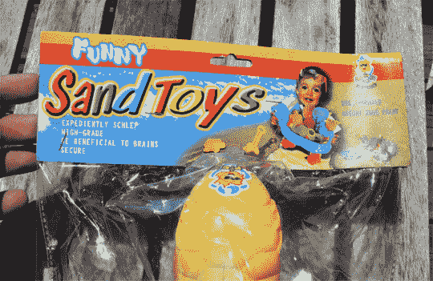

# 布鲁克林英语

> 原文：<https://web.archive.org/web/http://techcrunch.com:80/2007/06/17/brooklyn-engrish/>

这里没什么奇怪的……

只是周末庆典上的一些可爱的东西。我妻子买了这个沙滩玩具，一种附有铲子和水桶的鳄龟。当她把它带回家时，我们惊讶地发现，这是自哦，[明基](https://web.archive.org/web/20150625044202/http://gizmodo.com/gadgets/portable-media/wtf-alert-chinese-benq-musiq-dog-tag-player-site-has-guy-posing-in-front-of-wtc-ruins-218714.php)把他们的代言人模型贴在 WTC 的废墟上以来，对英语和文化敏感性最公然的漠视。

搞什么鬼？

我想看看他们翻译的字典。“方便携带？”“对大脑有益？”显然有人对这些可怜的包装制造商有一套。