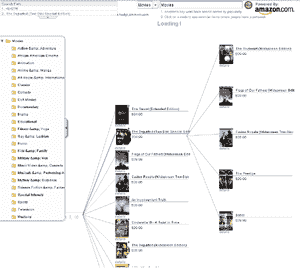

# BrowseGoods，BlackDogAir:两种新的购物方式 TechCrunch

> 原文：<https://web.archive.org/web/http://www.techcrunch.com:80/2007/02/19/browsegoods-blackdogair-2-new-ways-to-view-shopping/>

# 浏览商品，BlackDogAir:两种新的购物方式

去年，网上零售是一个超过 1000 亿美元的产业。 [Jupiter Media](https://web.archive.org/web/20221209132301/http://www.jupitermedia.com/corporate/releases/06.02.06-newjupresearch.html) 预计到 2010 年这一数字将超过 1400 亿美元。康姆斯克将这种增长归因于较低的价格以及网上购物是多么的简单。本周，两项新的亚马逊购物可视化服务出现在我们的办公桌上。下面来看看每一个。

 [BrowseGoods](https://web.archive.org/web/20221209132301/http://browsegoods.com/) :一家名为 [Dotted Pair](https://web.archive.org/web/20221209132301/http://dottedpair.com/) 的公司的产品，BrowseGoods 的购物界面向你展示了一张商品类别和子类别的地图(想想谷歌地图上的商品)。他们的第一个例子是鞋子，看起来有点像杜嘉班纳的块状世界地图。每个盒子都有一个类别标题，并分成更小的子类别标题，直到你放大到可以看到一堆鞋子缩略图。当一直放大时，你可以调出亚马逊的产品细节，也可以在所有产品图片中旋转。

如果我不知道我想要什么样的鞋子，BrowseGoods 方法似乎很有用，但是当我知道更多关于我想要的鞋子类型时，缺乏过滤是很麻烦的。在放大和仔细阅读鞋子选择的同时，处理这些类别的斑点状地理位置是很困难的。

[BlackDogAir](https://web.archive.org/web/20221209132301/http://www.blackdogair.com/index.html) :安迪兰默斯[的项目](https://web.archive.org/web/20221209132301/http://www.andylammers.com/)，BlackDogAir 把亚马逊的音乐、书籍和电影看做一个家谱。该树从垂直展开的亚马逊浏览页面开始。可以单击每个项目来查看详细信息，或者调出显示其相关项目的另一级树。

当前的购物可视化似乎没有减缓在线商务的步伐，但随着在线商品数量和种类的增长，将需要新的工具来分类和体验它们。我仍然认为 Like.com 是新的视觉购物引擎中最好的。