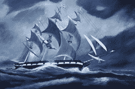

# BSA 为海盗提供 100 万美元的奖励，新的 CG 比赛宣布！

> 原文：<https://web.archive.org/web/http://techcrunch.com/2007/07/03/bsa-offers-1-million-reward-for-pirates-new-cg-contest-announced/>

虽然我们 CG [不宽恕盗版](https://web.archive.org/web/20140311002420/http://www.crunchgear.com/?s=piracy)，但我们一直在努力寻找可能盗版视频游戏和应用程序的新的有趣的企业和个人。为此，我们将提供一个特殊的 CrunchGear 盗版荣誉勋章，授予所有通过盗版软件谋生或在其组织内使用盗版软件的公司或个人。只需将您的姓名、地址和传真号码发送到 crunchgear dot com 参加竞赛。我们将在 5-10 个工作日内给您发送一枚适合装裱的精美奖章。海盗们，我们向你们致敬。

顺带一提，有人能把这个翻译成中文和俄文吗？对你来说可能有些钱。

[BSA 宣布悬赏 100 万美元缉拿盗版告密者](https://web.archive.org/web/20140311002420/http://arstechnica.com/news.ars/post/20070702-bsa-announces-1-million-award-for-piracy-snitches.html)