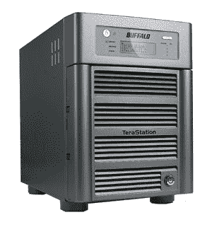

# Buffalo 将 Web 访问添加到 TeraStation Live NAS 驱动器| TechCrunch

> 原文：<https://web.archive.org/web/http://techcrunch.com/2007/08/14/buffalo-adds-web-access-to-terastation-live-nas-drives/>

因此，如果你正在购买一个网络连接存储驱动器，并且正在犹豫该买哪一个，Buffalo 增加了一个小 sum thin“sum thin”来提示你对他们有利的东西:你的数字文件的网络访问。现在，您可以从任何 Web 浏览器访问存储在 1、2 或 3TB TeraStation Live NAS 设备上的所有文件。

> 该设备包括自己的动态 DNS 服务器，因此用户只需登录[http://www.buffaloNAS.com](https://web.archive.org/web/20160305020528/http://www.buffalonas.com/)，输入他们的用户名，就可以立即访问他们所有的文件。此外，他们可以通过前往[http://www.buffaloNAS.com/theirusername](https://web.archive.org/web/20160305020528/http://www.buffalonas.com/theirusername)访问他们的设备。因为不需要下载软件，所以设置非常容易。Web 访问使用 UPnP(通用即插即用),无需防火墙配置即可在 TeraStation Live 和任何 web 浏览器之间实现无缝通信。

对我来说那听起来像是一个好时间。非常适合让您的朋友和家人欣赏您的数字媒体。记住:分享就是关爱。

[BUFFALO TECHNOLOGY 为其 TERASTATION LIVE NAS 设备增加了便捷的远程访问功能](https://web.archive.org/web/20160305020528/http://www.buffalotech.com/press/releases/buffalo-technology-adds-easy-remote-access-to-its-terastation-live-nas-device/)