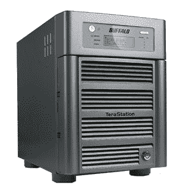

# 水牛城推出 3TB 令人兴奋的存储| TechCrunch

> 原文：<https://web.archive.org/web/http://techcrunch.com/2007/05/14/buffalo-pumps-out-3tb-of-storage-excitement/>

# Buffalo 推出 3TB 令人兴奋的存储

需要更多存储？买一个更大的硬盘。需要更多存储空间？从 Buffalo Technology 获得新的 3TB tera station Live(HS-DH 3.0 tgl/R5)或 3TB tera station Pro II(TS-h 3.0 tgl/R5)。网络连接存储驱动器于今天宣布并发布，标志着该公司声称自己是“当今市场上同类产品中速度最快的单个 NAS 设备，可提供高达 38MB/s 的超高速数据传输速率的高速处理器，可与 USB 2.0 硬盘媲美。”

对于不熟悉的人来说，TeraStation Live(已经有 1TB 和 2TB 版本)更多的是用于媒体共享，而不是简单的文件存储，它可以用作 iTunes 服务器，现在可以直接保存相机中的图片和视频。TeraStation Pro II(也有 1TB 和 2TB 版本)面向中小企业和 SOHO 客户，具有改进的电源管理和安全功能。

估计市场价为 2499 美元，它们当然不适合所有人。事实上，虽然我了解中小型企业对 Pro II 的需求，但我无法想象对消费者友好的 3TB 实时 NAS 驱动器的市场会很大，但你知道，也许这是一种“如果你建造它，他们就会来”的事情。

[BUFFALO 宣布推出首款 3TB NAS](https://web.archive.org/web/20130628195730/http://www.buffalotech.com/press/releases/buffalo-announces-the-first-3tb-nas-of-its-kind/)[新闻稿]