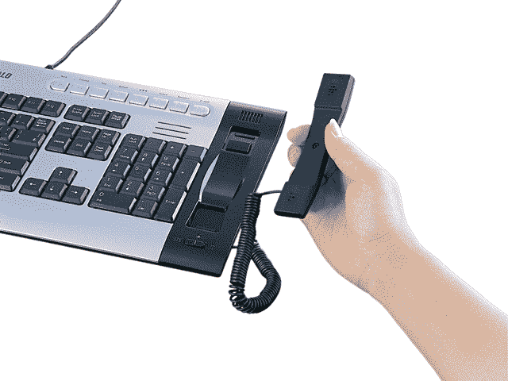

# 布法罗发布 Skype 键盘——TechCrunch

> 原文：<https://web.archive.org/web/http://techcrunch.com/2006/09/27/buffalo-releases-skype-keyboard/>

# 布法罗发布 Skype 键盘

[Skype手机遍地开花。在](https://web.archive.org/web/20201129052645/https://crunchbase.com/organization/skype)[的索尼 MP3 播放器](https://web.archive.org/web/20201129052645/http://www.sonystyle.com/is-bin/INTERSHOP.enfinity/eCS/Store/en/-/USD/SY_BrowseCatalog-Start?CategoryName=pa_PersonalCommunicators&CP=sony_8_28_explore_electronics_mylo&ref=http%3A//www.sony.com/index.php)，在鼠标的[，现在——当然——在键盘上。Buffalo 发布了这款 USB 键盘/手机，售价约为 60 美元。它没有扬声器功能，但上面有 109 个键。它也被命名为 BKBU-SKJ109/SV。十月份拿你的。](https://web.archive.org/web/20201129052645/http://crunchgear.com/2006/09/25/the-skype-mouse-makes-its-entrance/)

[BKBU-skj 109/SV](https://web.archive.org/web/20201129052645/http://pc.watch.impress.co.jp/docs/2006/0927/buffalo2.htm)【Impress via[Engadget](https://web.archive.org/web/20201129052645/http://www.engadget.com/2006/09/27/buffalos-usb-keyboard-and-skype-handset/)