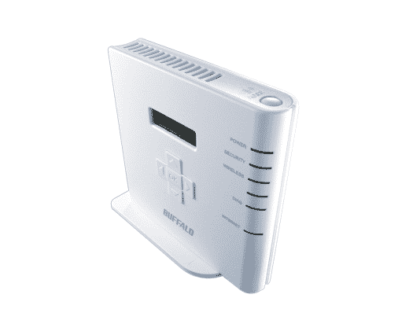

# Buffalo Wi-Fi Gamer 简化了在线无线游戏

> 原文：<https://web.archive.org/web/http://techcrunch.com/2007/07/27/buffalo-wi-fi-gamer-simplifies-online-wireless-gaming/>

以前，我曾经写过很多水牛城的小玩意，它们往往只在日本才有。然而，Wi-Fi 游戏玩家将在 8 月份的某个时候出现在我们的海岸上。这是一个以游戏为中心的类似路由器的设备，试图解决游戏玩家毫无疑问遇到的问题:用游戏机连接到 Wi-Fi 接入点可能是一个皇家的痛苦。(希望最后那句话没有触发什么过滤软件。)所以 Wi-Fi Gamer 简化了整个过程，一劳永逸地结束了在您的系统上输入 WEP 和 wpa 的情况。

在游戏者的顶部有一个按钮。按下该按钮，然后前往您选择的系统，并在设置菜单中选择 AOSS-AirStation one touch 安全系统。你的系统将连接到互联网，没有大惊小怪，没有混乱。玩家会记住你所有的安全设置等等，所以你不必每次想玩在线游戏时都重复输入。(水牛城与日本的任天堂和索尼合作，让 Wii、DS、PS3 和 PSP 在默认情况下与游戏玩家无缝协作。)

Buffalo Wi-Fi Gamer 可以被视为您的视频游戏系统的专用 Wi-Fi 网络:您不必直接连接到您的 Wi-Fi 网络，而是游戏玩家的中间网络。1UP 指出，父母可以利用这一点:如果你想限制孩子玩在线游戏的时间，就关掉游戏机。父母仍然可以使用 Wi-Fi 连接正常上网，但儿子被锁在外面。

Buffalo 的发行价格为 50 美元。嘿，乔希看到演示的时候很喜欢。如果这足以打动他(他玩世不恭，不关任何人的事)，我们普通人很可能也会喜欢。

[布法罗 Wi-Fi 游戏玩家](https://web.archive.org/web/20160528180322/http://www.1up.com/do/my1Up?publicUserId=5746297)【1UP Gear 博客】