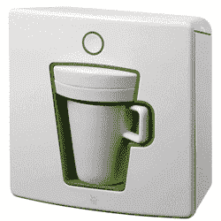

# 但是我从来不在家喝第二杯

> 原文：<https://web.archive.org/web/http://techcrunch.com:80/2007/05/01/but-i-never-have-a-second-cup-at-home/>

我们是极客，所以我们喝咖啡。很多咖啡。但是在家里做一整壶可能会很浪费，而且因为你一个人住，没有朋友，更不用说女性朋友了，所以你需要一些更高效和紧凑的东西。如果我没有首先描述问题，然后给出一个答案，这就不是一篇博客文章，所以看看 WMF1 单次服务便携式咖啡机。这就是它听起来的样子，看起来也不错。

显然它首先袭击了德国，但我们希望一些有进取心的进口商会帮助它找到去美国和美国的路。哦，它有不同的颜色，就像来自德国的其他东西一样。

[WMF](https://web.archive.org/web/20160421081825/http://www.wmf.com/content.asp?nv_id=1972&se_id=2129&sp_id=11&sid=%7BD8EF4B1E-BEA3-40CE-97B3-F2459CE58DE6%7D) 【产品页面，via [世界上最好的](https://web.archive.org/web/20160421081825/http://www.theworldsbestever.com/2007/05/single_cup_of_joe.php)