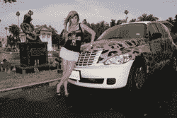

# Buzznet 上路| TechCrunch

> 原文：<https://web.archive.org/web/http://www.techcrunch.com:80/2007/07/06/buzznet-hits-the-road/>

专注于音乐的社交网络目的地 [Buzznet](https://web.archive.org/web/20150909061839/http://www.crunchbase.com/company/buzznet) ，一项我们在 5 月 24 日称之为最大的社交网络的服务，许多人可能从未听说过，正在带着他们的信息和品牌上路。

Buzznet 聘请了 21 岁的博主 Audrey Kitching 作为旅行记者，报道为期 9 周、覆盖 45 个城市的 2007 年面包车扭曲之旅。

Kitching 将发送视频和书面材料，包括与乐队的后台采访和与粉丝的现场讨论。Kitching 将乘坐定制的 Buzznet PT cruiser 旅行(见图)，让 Buzznet 接触数百万音乐迷和公路旅行者；尽管我注意到看着这辆车，它也可能会蒙蔽高速公路上的同行者。

在这个社交网站多如牛毛的时代，这是一个聪明的想法。对任何创业公司来说，被人看到不再是关键。我被告知，Kitching 将自由报道她所看到的事件，所以这不是一个沃尔玛式的事件。尽管有些人不在这种推广方式的目标人群中，但不难理解这是 Buzznet 的一个聪明的营销举措。

Kitching 的旅行可以在 Buzznet [这里](https://web.archive.org/web/20150909061839/http://audrey.buzznet.com/user/)关注。之前的 TechCrunch Buzznet 报道[点击这里](https://web.archive.org/web/20150909061839/http://www.techcrunch.com/tag/buzznet)。