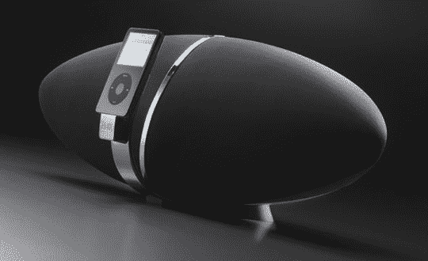

# B&W·齐柏林 iPod 扬声器:可能是迄今为止最好看的一款

> 原文：<https://web.archive.org/web/http://techcrunch.com/2007/08/02/bw-zeppelin-ipod-speaker-could-be-the-best-looking-one-yet/>

今天又有一个关于齐柏林飞艇的故事。但这不是关于历史上除了披头士之外最被高估的乐队，而是关于一个 iPod 扬声器，它看起来很独特，足以阅读下面的几句话。B & W 称它为齐柏林飞艇，大概是因为它的外形，而不是 B & W 对华而不实的摇滚乐队的喜爱。在那里的某个地方，你会发现一个 5 英寸的低音炮，总功率为 100 瓦。

鉴于 B&W 的血统，我们可以假设齐柏林飞艇是一个可靠的[。600 美元的固体？我想，你说了算。](https://web.archive.org/web/20150910071658/http://www.urbandictionary.com/define.php?term=solid)

[B & W](https://web.archive.org/web/20150910071658/http://www.bowers-wilkins.com/) via [科幻科技](https://web.archive.org/web/20150910071658/http://blog.scifi.com/tech/archives/2007/08/01/bw_floats_into.html)