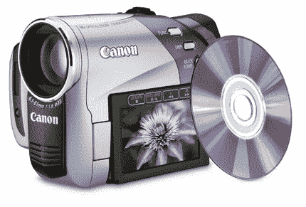

# 佳能发布 DC50 DVD 摄像机

> 原文：<https://web.archive.org/web/http://techcrunch.com/2007/01/05/canon-announces-dc50-dvd-camcorder/>

# 佳能发布 DC50 DVD 摄像机

佳能刚刚宣布其新的 DC50 DVD 摄像机。这款 799 美元的手持摄像机功能丰富，非常适合那些徘徊在业余爱好者和专业人士之间的人。DC50 提供直接到 DVD 的录制、用于 500 万像素照片的 539 万像素 CCD 图像传感器、10 倍光学/200 倍数字变焦、DIGIC DV II 技术、水平和网格图像标记，以及以真正的高清进行录制的能力。

你可以和这个坏男孩一起捕捉一些甜蜜的镜头。然后，您可以通过 USB 2.0 传输所有内容，并使用附带的 Roxio 软件进行编辑。想要 DC50 吗？你必须熬到二月中旬，那时它就要发行了。