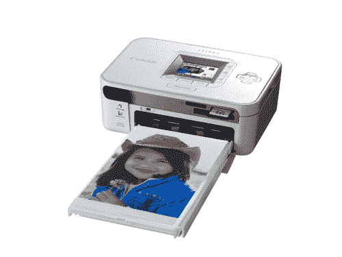

# 佳能宣布推出小型便携式打印机

> 原文：<https://web.archive.org/web/http://techcrunch.com:80/2007/07/02/canon-announces-pint-sized-portable-printer/>

# 佳能宣布推出小型便携式打印机

如果你是那些在旅游景点附近以荒谬的价格为人们拍照的烦人的摄影师之一，那么你肯定会对佳能最新的便携式打印机感兴趣。小型 SELPHY CP740 打印机不到一分钟就能打印出 4×6 英寸实验室质量的照片。它还包括自动红眼消除、2 英寸彩色液晶屏和多种直接打印选项。

CP740 将于秋季上市，售价为 99.99 美元。至少这样你可以打印出更好的图片，人们会更愿意购买它们。

[新闻稿](https://web.archive.org/web/20130628154150/http://www.usa.canon.com/templatedata/pressrelease/20070702_selphycp740.html)