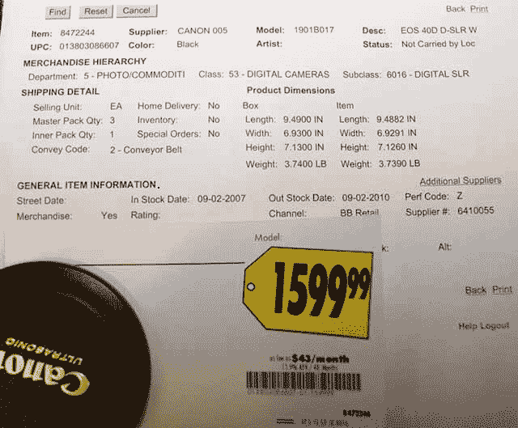

# 佳能 EOS 40D 细节泄露

> 原文：<https://web.archive.org/web/http://techcrunch.com/2007/08/08/canon-eos-40d-details-leaked/>

令人难以捉摸又备受期待的佳能 40D 刚刚被泄露。至少是上市日期和价格。根据百思买的规格表，9 月 2 日看起来是推出日期，它的零售价为 1599.99 美元。跳跃后剩下的规格。

布鲁克斯，谢谢你的提示！

佳能 40D 规格:

* 1020 万像素 APS-C 尺寸 CMOS 传感器
* 5 fps 和 30 大 JPEG 帧连拍
*集成清洁系统
* 2.5 "，230K 像素， 170°广视角液晶屏
*画面风格图像处理参数
*点测光和高精度 9 点自动对焦系统
* DIGIC III 图像处理器，启动时间为 0.15 秒
*数码照片专业 RAW 处理软件
* 10 万次循环快门耐久性和坚固的镁合金机身
* RAW 和 JPEG 同步录制
*宽 100-3200 ISO 范围
* E-TTL II 闪光灯
* 1